# Báo cáo tổng hợp — Task10: tái xây dựng 5 phương pháp Federated Learning

Báo cáo này tổng hợp năm phương pháp học liên kết đã được tái xây dựng trên cùng
một bộ dữ liệu và cùng ba kịch bản mô hình, kèm toàn bộ kết quả đo được.

**Tài liệu này được sinh tự động** bởi [`scripts/build_report.py`](../scripts/build_report.py)
từ chính các file `metrics/evaluation_metrics.csv` của 15 lần chạy. Mọi con số
trong báo cáo đều đọc trực tiếp từ output, không nhập tay.

## Mục lục

1. [Bối cảnh thí nghiệm chung](#1-bối-cảnh-thí-nghiệm-chung)
2. [Bảng tra nhanh năm bài báo](#2-bảng-tra-nhanh-năm-bài-báo)
3. [FD-IDS](#3-fd-ids)
4. [PerFed-SKD](#4-perfed-skd)
5. [FedCAPS](#5-fedcaps)
6. [pFedES](#6-pfedes)
7. [ProxyModel](#7-proxymodel)
8. [So sánh chéo năm phương pháp](#8-so-sánh-chéo-năm-phương-pháp)
9. [Phân tích điểm mạnh — điểm yếu](#9-phân-tích-điểm-mạnh--điểm-yếu)
10. [Kết luận](#10-kết-luận)

---

## 1. Bối cảnh thí nghiệm chung

Cả năm phương pháp chạy trên **đúng cùng một cấu hình** để kết quả so sánh được:

| Thành phần | Giá trị |
|---|---|
| Bộ dữ liệu | CICIoT2023, 25 feature, **34 lớp**, phân loại đơn nhãn đa lớp |
| Số client | 10 |
| Tổng dữ liệu huấn luyện | 36.014.594 dòng |
| Tập test | `global_test_data.csv`, **9.003.649 dòng**, dùng chung cho mọi entity |
| Số round | 10 |
| Local epoch mỗi round | 1 |
| Batch size | 1024/client |
| Seed | 42 |
| Phần cứng | Kaggle, đúng 2× NVIDIA Tesla T4 |
| Kiến trúc | GRU 40.034 · Transformer 71.010 · CNN-1D 35.874 tham số |

### Mức độ non-IID

Đây là điểm quyết định cách đọc mọi con số bên dưới. Phân bố dữ liệu giữa 10
client cực kỳ lệch:

| Client | Số dòng | Số lớp có mặt | Tỷ lệ lớp lớn nhất |
|---:|---:|---:|---:|
| 1 | 31.520 | 8/34 | 87,7% |
| 2 | 2.211.589 | 21/34 | 24,1% |
| 3 | 3.728.450 | 25/34 | 47,6% |
| 4 | 1.920.254 | 8/34 | 83,0% |
| 5 | 2.531.881 | 14/34 | 73,1% |
| 6 | 2.686.617 | 5/34 | 84,7% |
| 7 | 1.824.975 | 11/34 | 86,4% |
| 8 | 12.759.509 | 28/34 | 24,4% |
| 9 | 4.354.192 | 19/34 | 75,8% |
| 10 | 3.965.607 | 14/34 | 38,7% |

Client 6 chỉ thấy **5 trên 34 lớp**; client 1 có 87,7% dữ liệu dồn vào một lớp
duy nhất và chỉ có 31.520 dòng, trong khi client 8 có 12,7 triệu dòng. Tỷ lệ
chênh lệch dữ liệu giữa client lớn nhất và nhỏ nhất là **hơn 400 lần**.

> **Hệ quả then chốt cho việc đọc kết quả:** mọi entity đều được chấm trên
> **cùng một tập test toàn cục có đủ 34 lớp**. Một model personalized học tốt
> 5 lớp của client mình sẽ bị chấm điểm rất thấp trên tập test 34 lớp — không
> phải vì nó học kém, mà vì nó **được thiết kế để không tổng quát**. Đây là lý
> do các phương pháp personalized (FedCAPS, pFedES, ProxyModel-client) có số
> thấp hơn hẳn các phương pháp global (FD-IDS, ProxyModel-server). So sánh
> trực tiếp giữa hai nhóm là **không công bằng**, và báo cáo này tách riêng
> cột server với cột client ở mọi bảng để tránh nhầm lẫn.

### Hợp đồng đo lường

Mỗi entity áp dụng được đánh giá trên **toàn bộ** `global_test_data.csv` ngay
sau mỗi round bằng đúng 10 cột:

`accuracy` · `macro_precision` · `micro_precision` · `weighted_precision` ·
`macro_recall` · `micro_recall` · `weighted_recall` · `macro_f1` · `micro_f1` ·
`weighted_f1`

Với phân loại đơn nhãn đa lớp, bốn đại lượng `accuracy`, `micro_precision`,
`micro_recall`, `micro_f1` **bằng nhau về mặt toán học** — trong các bảng dưới
bạn sẽ thấy bốn cột này trùng số. Đây là đúng, không phải lỗi.

Toàn bộ 1.590 hàng metric đã được **kiểm chứng lại bằng cách tính lại từ
confusion matrix thô** (`.npy`): sai lệch tối đa 2,2 × 10⁻¹⁶.

---

## 2. Bảng tra nhanh năm bài báo

| # | Phương pháp | Bài báo | Năm | Nguồn xác định năm |
|---|---|---|---|---|
| 1 | **FD-IDS** | FD-IDS: A Federated Learning and Knowledge Distillation-Based Intrusion Detection System for Non-IID IoT Environments | 2025 | ghi rõ trong bài báo |
| 2 | **PerFed-SKD** | Personalized Federated Learning for Heterogeneous Edge Device: Self-Knowledge Distillation Approach | ~2023–2024 | suy ra từ tham chiếu mới nhất trong bài là 2023 — cần đối chiếu bản gốc |
| 3 | **FedCAPS** | Permutation-Invariant Representation Learning for Robust and Privacy-Preserving Feature Selection (FedCAPS) | 2025 | mã arXiv 2510 = tháng 10/2025 |
| 4 | **pFedES** | pFedES: Generalized Proxy Feature Extractor Sharing for Model Heterogeneous Personalized Federated Learning | ~2024 | tham chiếu mới nhất trong bài là 2024 — cần đối chiếu bản gốc |
| 5 | **ProxyModel** | Lightweight Federated Learning for On-Device Non-Intrusive Load Monitoring | 2025 | tiền tố năm trong tên file + tham chiếu mới nhất 2024 |

> **Cảnh báo về năm xuất bản:** chỉ FD-IDS ghi rõ nơi/năm xuất bản trong file
> (`Sensors 2025, 25, 4309`) và FedCAPS suy được chắc chắn từ mã arXiv
> (`2510` = tháng 10/2025). Ba bài còn lại **không có trang tiêu đề đầy đủ**
> trong bản `.md` lưu tại repo, nên năm ghi ở trên là **suy đoán từ tham chiếu
> mới nhất trong bài** — cần đối chiếu bản gốc trước khi trích dẫn.

Bảng khả năng làm việc với mô hình dị thể (chi tiết ở từng mục):

| Phương pháp | Khác **kích thước** mô hình | Khác **loại** mô hình | Thứ được truyền lên server |
|---|:---:|:---:|---|
| FD-IDS | ✗ | ✗ | toàn bộ tham số classifier |
| PerFed-SKD | ✗ | ✗ | toàn bộ tham số classifier |
| FedCAPS | ✓ | ✓ | chỉ số feature + điểm hiệu năng |
| pFedES | ✓ | ✓ | proxy extractor **57 tham số** |
| ProxyModel | ✓ | ✓ | proxy classifier 35.874 tham số |

---

## 3. FD-IDS

### 3.1. Bài báo

- **Tên:** FD-IDS: A Federated Learning and Knowledge Distillation-Based Intrusion Detection System for Non-IID IoT Environments
- **Tác giả:** Huaiyuan Peng, Yanfeng Xiao, Chunming Wu
- **Năm:** 2025 — *ghi rõ trong bài báo*
- **Nơi xuất bản:** Sensors 2025, 25, 4309 (MDPI)
- **File trong repo:** [`fd_ids_noniid/sensors-25-04309.md`](../fd_ids_noniid/sensors-25-04309.md)

### 3.2. Quy trình huấn luyện của bài báo gốc

Bài báo giải bài toán phát hiện xâm nhập IoT trên dữ liệu non-IID. Quy trình gốc:

1. **Tiền xử lý + chọn đặc trưng.** Loại các feature nhạy cảm (`ip.src_host`,
   `udp.port`…), bỏ dòng thiếu/vô hạn, one-hot cho biến hạng mục, chuẩn hoá
   Z-score. Sau đó dùng **Mutual Information** xếp hạng feature và giữ **top-25**
   với Edge-IIoT (top-71 với N-BaIoT).
2. **Mô hình.** Một DNN gồm 5 tầng ẩn 32–64–128–64–32, ReLU, softmax đầu ra;
   Adam, lr = 0,001.
3. **Vòng liên kết.** Mọi client tham gia mỗi round (`m = K`). Server phát
   `w_G^t`; client khởi tạo `w_k ← w_G^t` rồi huấn luyện `E` epoch cục bộ.
4. **Hàm mất mát cục bộ** kết hợp ba thành phần (Eq. 6):
   `L = λ·L_hard + (1−λ)·L_soft + β·L_proximal`, với `L_soft` là KL giữa
   softmax(Z_teacher/T) và softmax(Z_student/T) nhân `T²` (KD, global model làm
   teacher), `L_proximal = (μ/2)·‖w_k − w_G^t‖²` (FedProx). Tham số gốc:
   **T = 3, λ = 0,5, μ = 0,01, β = 0,1**.
5. **Tổng hợp.** FedAvg có trọng số theo số mẫu: `w_G^{t+1} = Σ (n_k/n)·w_k^{t+1}`.

Điểm mấu chốt: KD và proximal term cùng kéo model cục bộ về phía global model để
chống *model drift* do non-IID. Đầu ra cuối cùng là **một global model duy nhất**.

### 3.3. Bản build lại — giữ gì, đổi gì

| Thành phần | Bài gốc | Bản build lại | Đánh giá |
|---|---|---|---|
| Bộ dữ liệu | Edge-IIoT, N-BaIoT | **CICIoT2023**, 25 feature, 34 lớp | **Khác** |
| Chọn feature | MI top-25 | dữ liệu đã rút còn 25 feature từ upstream | Giữ tinh thần (đúng 25) |
| Classifier | DNN 32-64-128-64-32 | **GRU / Transformer / CNN-1D** | **Khác** |
| Optimizer | Adam, lr 0,001 | Adam, lr 0,001 | Giữ nguyên |
| KD temperature `T` | 3 | 3 | Giữ nguyên |
| `λ` hard/soft | 0,5 | 0,5 | Giữ nguyên |
| FedProx `μ` | 0,01 | 0,01 | Giữ nguyên |
| Trọng số proximal `β` | 0,1 | 0,1 | Giữ nguyên |
| Teacher | global snapshot đầu round | global snapshot đầu round | Giữ nguyên |
| Tỷ lệ client/round | 100% (`m = K`) | 100% (10/10) | Giữ nguyên |
| Tổng hợp | FedAvg có trọng số `n_k/n` | FedAvg có trọng số `n_k/n` | Giữ nguyên |
| Số round | không cố định | **10** | **Khác (chuẩn hoá)** |
| Local epoch | `E` | **1** | **Khác (chuẩn hoá)** |

**Lý do đổi classifier:** để năm phương pháp so được với nhau, cả năm dùng chung
ba backbone (GRU 40.034 / Transformer 71.010 / CNN-1D 35.874 tham số). Cơ chế
FD-IDS — KD + FedProx + FedAvg — không phụ thuộc kiến trúc nên thay backbone
không phá vỡ phương pháp.

### 3.4. Có dùng được cho mô hình không đồng nhất không?

**Kết luận: **Không** — cả hai loại đều không.**

FD-IDS tổng hợp bằng `w_G = Σ (n_k/n)·w_k` trên **toàn bộ tham số classifier**.
Phép cộng này chỉ định nghĩa được khi mọi client có **cùng kiến trúc và cùng số
tham số**. Thêm nữa, `L_proximal = (μ/2)·‖w_k − w_G‖²` cũng đòi hỏi `w_k` và
`w_G` nằm trong cùng không gian tham số.

- **Khác kích thước mô hình:** không. Vector tham số phải khớp từng phần tử.
- **Khác loại mô hình:** không. GRU và CNN-1D không có tham số tương ứng nhau.

*Muốn dùng cho môi trường dị thể thì phải thay tầng tổng hợp* — ví dụ chỉ FedAvg
phần đầu chung, hoặc chuyển hẳn sang chưng cất logits trên tập public. KD trong
FD-IDS **không** làm được việc đó vì teacher là global model có cùng kiến trúc,
không phải một kênh trao đổi độc lập kiến trúc.

### 3.5. Kết quả đo được

#### FD-IDS — 10 client GRU

- Thư mục run: [`fd_ids_noniid/10_clients_gru/task10_fd_ids_noniid_10c_gru`](../fd_ids_noniid/10_clients_gru/task10_fd_ids_noniid_10c_gru)
- Thời gian chạy: **22.1 phút** trên 2×T4 · Truyền thông 10 round: **30.544 MiB**

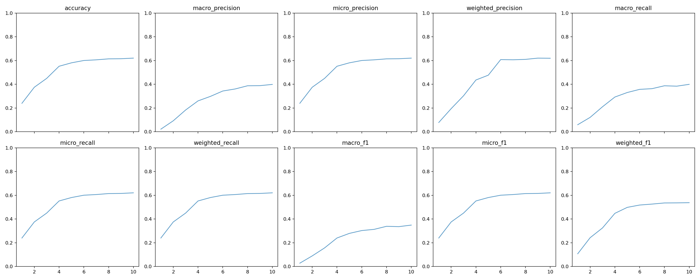

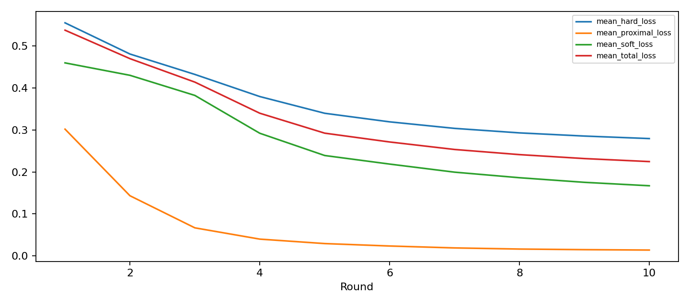

*Bảng — FD-IDS · GRU · **server** · 10 metrics trên `global_test_data.csv` theo từng round*

| Round | accuracy | macro_P | micro_P | weighted_P | macro_R | micro_R | weighted_R | macro_F1 | micro_F1 | weighted_F1 |
|---:|---:|---:|---:|---:|---:|---:|---:|---:|---:|---:|
| 1 | 0.2397 | 0.0218 | 0.2397 | 0.0781 | 0.0592 | 0.2397 | 0.2397 | 0.0276 | 0.2397 | 0.1068 |
| 2 | 0.3749 | 0.0923 | 0.3749 | 0.1945 | 0.1209 | 0.3749 | 0.3749 | 0.0888 | 0.3749 | 0.2420 |
| 3 | 0.4497 | 0.1833 | 0.4497 | 0.3030 | 0.2104 | 0.4497 | 0.4497 | 0.1563 | 0.4497 | 0.3244 |
| 4 | 0.5518 | 0.2599 | 0.5518 | 0.4360 | 0.2924 | 0.5518 | 0.5518 | 0.2397 | 0.5518 | 0.4475 |
| 5 | 0.5807 | 0.2979 | 0.5807 | 0.4767 | 0.3305 | 0.5807 | 0.5807 | 0.2786 | 0.5807 | 0.4978 |
| 6 | 0.6003 | 0.3432 | 0.6003 | 0.6079 | 0.3570 | 0.6003 | 0.6003 | 0.3024 | 0.6003 | 0.5175 |
| 7 | 0.6059 | 0.3604 | 0.6059 | 0.6064 | 0.3630 | 0.6059 | 0.6059 | 0.3125 | 0.6059 | 0.5255 |
| 8 | 0.6142 | 0.3873 | 0.6142 | 0.6097 | 0.3873 | 0.6142 | 0.6142 | 0.3382 | 0.6142 | 0.5351 |
| 9 | 0.6153 | 0.3884 | 0.6153 | 0.6203 | 0.3840 | 0.6153 | 0.6153 | 0.3355 | 0.6153 | 0.5357 |
| 10 | 0.6204 | 0.3987 | 0.6204 | 0.6192 | 0.3994 | 0.6204 | 0.6204 | 0.3485 | 0.6204 | 0.5374 |

#### FD-IDS — 10 client Transformer

- Thư mục run: [`fd_ids_noniid/10_clients_transformer/task10_fd_ids_noniid_10c_transformer`](../fd_ids_noniid/10_clients_transformer/task10_fd_ids_noniid_10c_transformer)
- Thời gian chạy: **61.9 phút** trên 2×T4 · Truyền thông 10 round: **54.176 MiB**

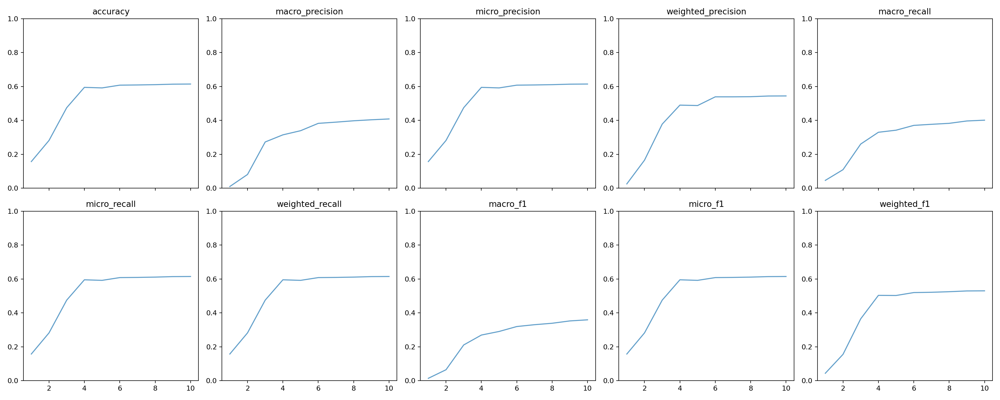

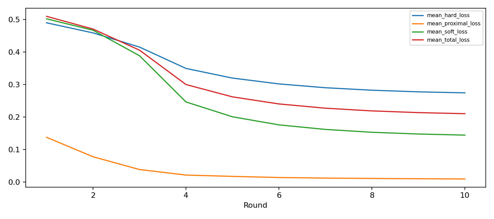

*Bảng — FD-IDS · Transformer · **server** · 10 metrics trên `global_test_data.csv` theo từng round*

| Round | accuracy | macro_P | micro_P | weighted_P | macro_R | micro_R | weighted_R | macro_F1 | micro_F1 | weighted_F1 |
|---:|---:|---:|---:|---:|---:|---:|---:|---:|---:|---:|
| 1 | 0.1570 | 0.0099 | 0.1570 | 0.0254 | 0.0461 | 0.1570 | 0.1570 | 0.0137 | 0.1570 | 0.0436 |
| 2 | 0.2816 | 0.0809 | 0.2816 | 0.1653 | 0.1093 | 0.2816 | 0.2816 | 0.0643 | 0.2816 | 0.1551 |
| 3 | 0.4749 | 0.2727 | 0.4749 | 0.3779 | 0.2604 | 0.4749 | 0.4749 | 0.2105 | 0.4749 | 0.3646 |
| 4 | 0.5948 | 0.3147 | 0.5948 | 0.4900 | 0.3299 | 0.5948 | 0.5948 | 0.2689 | 0.5948 | 0.5030 |
| 5 | 0.5916 | 0.3391 | 0.5916 | 0.4876 | 0.3422 | 0.5916 | 0.5916 | 0.2900 | 0.5916 | 0.5023 |
| 6 | 0.6078 | 0.3825 | 0.6078 | 0.5389 | 0.3705 | 0.6078 | 0.6078 | 0.3191 | 0.6078 | 0.5195 |
| 7 | 0.6089 | 0.3896 | 0.6089 | 0.5389 | 0.3769 | 0.6089 | 0.6089 | 0.3300 | 0.6089 | 0.5212 |
| 8 | 0.6107 | 0.3976 | 0.6107 | 0.5397 | 0.3826 | 0.6107 | 0.6107 | 0.3385 | 0.6107 | 0.5246 |
| 9 | 0.6136 | 0.4036 | 0.6136 | 0.5437 | 0.3965 | 0.6136 | 0.6136 | 0.3523 | 0.6136 | 0.5291 |
| 10 | 0.6144 | 0.4085 | 0.6144 | 0.5442 | 0.4012 | 0.6144 | 0.6144 | 0.3587 | 0.6144 | 0.5298 |

#### FD-IDS — 10 client CNN-1D

- Thư mục run: [`fd_ids_noniid/10_clients_cnn1d/task10_fd_ids_noniid_10c_cnn1d`](../fd_ids_noniid/10_clients_cnn1d/task10_fd_ids_noniid_10c_cnn1d)
- Thời gian chạy: **24.7 phút** trên 2×T4 · Truyền thông 10 round: **27.716 MiB**

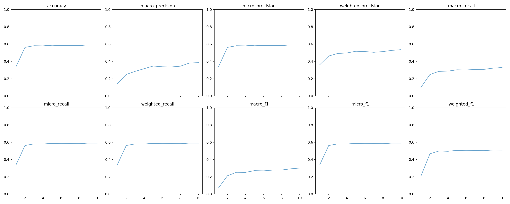

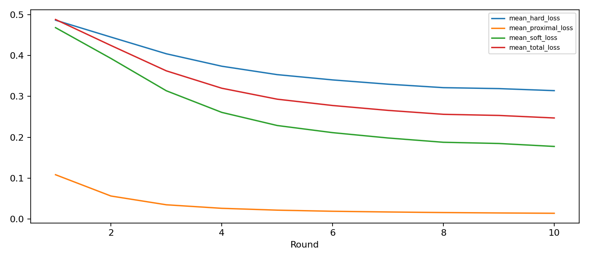

*Bảng — FD-IDS · CNN-1D · **server** · 10 metrics trên `global_test_data.csv` theo từng round*

| Round | accuracy | macro_P | micro_P | weighted_P | macro_R | micro_R | weighted_R | macro_F1 | micro_F1 | weighted_F1 |
|---:|---:|---:|---:|---:|---:|---:|---:|---:|---:|---:|
| 1 | 0.3375 | 0.1401 | 0.3375 | 0.3605 | 0.0992 | 0.3375 | 0.3375 | 0.0707 | 0.3375 | 0.2084 |
| 2 | 0.5621 | 0.2489 | 0.5621 | 0.4620 | 0.2483 | 0.5621 | 0.5621 | 0.2126 | 0.5621 | 0.4666 |
| 3 | 0.5812 | 0.2855 | 0.5812 | 0.4919 | 0.2853 | 0.5812 | 0.5812 | 0.2527 | 0.5812 | 0.4985 |
| 4 | 0.5798 | 0.3161 | 0.5798 | 0.4973 | 0.2875 | 0.5798 | 0.5798 | 0.2518 | 0.5798 | 0.4954 |
| 5 | 0.5869 | 0.3464 | 0.5869 | 0.5171 | 0.3028 | 0.5869 | 0.5869 | 0.2717 | 0.5869 | 0.5063 |
| 6 | 0.5837 | 0.3376 | 0.5837 | 0.5140 | 0.3004 | 0.5837 | 0.5837 | 0.2691 | 0.5837 | 0.5023 |
| 7 | 0.5848 | 0.3356 | 0.5848 | 0.5051 | 0.3076 | 0.5848 | 0.5848 | 0.2781 | 0.5848 | 0.5043 |
| 8 | 0.5835 | 0.3447 | 0.5835 | 0.5133 | 0.3079 | 0.5835 | 0.5835 | 0.2786 | 0.5835 | 0.5032 |
| 9 | 0.5902 | 0.3805 | 0.5902 | 0.5276 | 0.3221 | 0.5902 | 0.5902 | 0.2925 | 0.5902 | 0.5103 |
| 10 | 0.5901 | 0.3861 | 0.5901 | 0.5356 | 0.3290 | 0.5901 | 0.5901 | 0.3017 | 0.5901 | 0.5094 |

---

## 4. PerFed-SKD

### 4.1. Bài báo

- **Tên:** Personalized Federated Learning for Heterogeneous Edge Device: Self-Knowledge Distillation Approach
- **Tác giả:** Neha Singh, Jatin Rupchandani, Mainak Adhikari
- **Năm:** ~2023–2024 — *suy ra từ tham chiếu mới nhất trong bài là 2023 — cần đối chiếu bản gốc*
- **Nơi xuất bản:** tạp chí IEEE (bản .md không ghi số/volume)
- **File trong repo:** [`perfed_skd/Personalized_Federated_Learning_for_Heterogeneous_Edge_Device_Self-Knowledge_Distillation_Approach.md`](../perfed_skd/Personalized_Federated_Learning_for_Heterogeneous_Edge_Device_Self-Knowledge_Distillation_Approach.md)

### 4.2. Quy trình huấn luyện của bài báo gốc

Bài báo hướng tới personalized FL cho edge device yếu và băng thông hạn chế.
Quy trình gốc gồm bảy pha (Fig. 2), rút gọn thành hai thuật toán:

1. **Server khởi tạo** global model `ω⁰` bằng cách huấn luyện trên một tập dữ
   liệu định sẵn `D` (Algorithm 1, dòng 2).
2. **Self-knowledge distillation tại client.** Mỗi edge device `m` giữ một
   *historical personalized model* `V_m` — chính là bản local model của round
   trước. Hàm mất mát cục bộ (Eq. 2):
   `φ_m(ω_m^t) = f_m(ω_m^t) + λ·L( x(V_m) ‖ x(ω_m^t) )`,
   tức CE cứng cộng phân kỳ giữa dự đoán hiện tại và dự đoán của chính mình ở
   quá khứ. Cập nhật bằng SGD (Eq. 3). Sau mỗi round: `V_m ← ω_m^t`.
3. **Chọn client theo ngưỡng accuracy.** Server tính ngưỡng `τ = A` với `A` là
   accuracy trung bình toàn hệ; client nào có `a < τ` được đưa vào tập `S` và sẽ
   **nhận global model ở round sau**; client còn lại giữ nguyên trạng thái cục bộ
   của mình (Algorithm 2, dòng 4–8).
4. **Tổng hợp không trọng số** chỉ trên các client được chọn:
   `ω^{t+1} ← Σ_{m∈S} ω^{t+1} / |S|` (Algorithm 1, dòng 10).

Đầu ra cuối cùng là **10 personalized model**, không phải global model. Thí
nghiệm gốc chạy trên MNIST và EMNIST.

### 4.3. Bản build lại — giữ gì, đổi gì

| Thành phần | Bài gốc | Bản build lại | Đánh giá |
|---|---|---|---|
| Bộ dữ liệu | MNIST, EMNIST | **CICIoT2023** | **Khác** |
| Server pretrain | trên tập định sẵn `D` | **đúng 1 epoch** trên `global_train_data.csv` | Giữ nguyên (cố định số epoch) |
| SKD teacher | model cục bộ round trước `V_m` | model cục bộ round trước `V_m` | Giữ nguyên |
| Loss cục bộ | `f_m + λ·L(x(V_m)‖x(ω_m))` | CE + phân kỳ với teacher lịch sử | Giữ nguyên |
| Optimizer | SGD | SGD, lr 0,01 | Giữ nguyên |
| Ngưỡng chọn client | `τ` = accuracy trung bình | `τ` = accuracy trung bình của đủ 10 client | Giữ nguyên |
| Nguồn accuracy chọn client | local accuracy | **local validation 10% phân tầng, seed 42** | Làm chặt lại |
| Tổng hợp | trung bình **không trọng số** trên `S` | trung bình không trọng số trên `S` | Giữ nguyên |
| Số round | `T` | **10** | **Khác (chuẩn hoá)** |
| Local epoch | `E` | **1** | **Khác (chuẩn hoá)** |

**Điểm làm chặt:** bài gốc không nói rõ accuracy dùng để chọn client lấy từ đâu.
Bản build lại tách **10% validation phân tầng** khỏi dữ liệu client (seed 42) và
chỉ dùng tập này để chọn client. `global_test_data.csv` **không** tham gia điều
khiển training — điều này quan trọng vì nếu dùng global test để chọn client thì
kết quả sẽ bị rò rỉ.

### 4.4. Có dùng được cho mô hình không đồng nhất không?

**Kết luận: **Không** cho khác kiến trúc; **một phần** cho khác tải tính toán.**

PerFed-SKD có hai cơ chế cần tách bạch:

- **SKD (`V_m` là chính mình ở round trước)** — hoàn toàn độc lập kiến trúc.
  Mỗi client tự chưng cất từ lịch sử của mình, không cần biết client khác dùng gì.
- **Tổng hợp `ω^{t+1} ← Σ_{m∈S} ω^{t+1}/|S|`** — vẫn là trung bình tham số, nên
  **vẫn đòi hỏi kiến trúc đồng nhất**.

- **Khác kích thước mô hình:** không.
- **Khác loại mô hình:** không.

Tuy nhiên cơ chế **chọn client theo ngưỡng accuracy** giải quyết được *dị thể về
tài nguyên*: client yếu/chậm không bị ép nhận global model mỗi round, giảm tải
tính toán và truyền thông. Đây chính là mục tiêu bài báo tuyên bố ("heterogeneous
edge device") — dị thể **thiết bị**, không phải dị thể **mô hình**.

### 4.5. Kết quả đo được

#### PerFed-SKD — 10 client GRU

- Thư mục run: [`perfed_skd/10_clients_gru/task10_perfed_skd_10c_gru`](../perfed_skd/10_clients_gru/task10_perfed_skd_10c_gru)
- Thời gian chạy: **21.8 phút** trên 2×T4 · Truyền thông 10 round: **13.745 MiB**

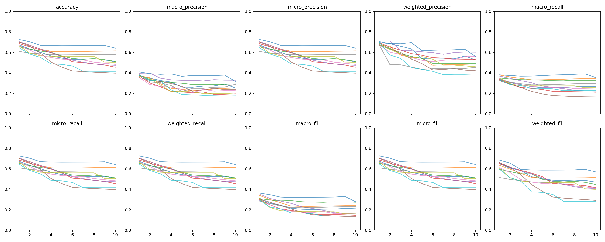

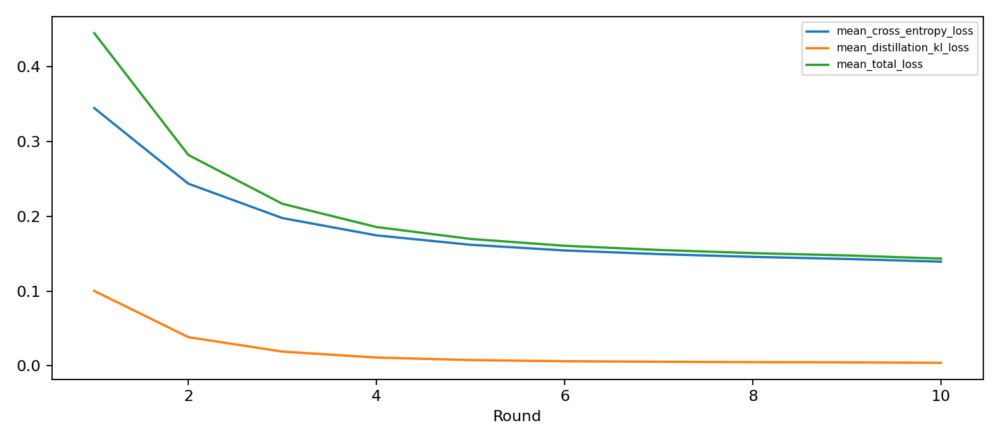

*Bảng — PerFed-SKD · GRU · **server** · 10 metrics trên `global_test_data.csv` theo từng round*

| Round | accuracy | macro_P | micro_P | weighted_P | macro_R | micro_R | weighted_R | macro_F1 | micro_F1 | weighted_F1 |
|---:|---:|---:|---:|---:|---:|---:|---:|---:|---:|---:|
| 1 | 0.7261 | 0.4092 | 0.7261 | 0.7046 | 0.3799 | 0.7261 | 0.7261 | 0.3638 | 0.7261 | 0.6852 |
| 2 | 0.7030 | 0.3917 | 0.7030 | 0.6844 | 0.3749 | 0.7030 | 0.7030 | 0.3473 | 0.7030 | 0.6544 |
| 3 | 0.6687 | 0.3852 | 0.6687 | 0.6826 | 0.3671 | 0.6687 | 0.6687 | 0.3235 | 0.6687 | 0.5935 |
| 4 | 0.6651 | 0.3895 | 0.6651 | 0.6951 | 0.3682 | 0.6651 | 0.6651 | 0.3194 | 0.6651 | 0.5882 |
| 5 | 0.6643 | 0.3657 | 0.6643 | 0.6155 | 0.3735 | 0.6643 | 0.6643 | 0.3198 | 0.6643 | 0.5868 |
| 6 | 0.6646 | 0.3747 | 0.6646 | 0.6198 | 0.3785 | 0.6646 | 0.6646 | 0.3220 | 0.6646 | 0.5870 |
| 7 | 0.6647 | 0.3756 | 0.6647 | 0.6223 | 0.3810 | 0.6647 | 0.6647 | 0.3224 | 0.6647 | 0.5873 |
| 8 | 0.6650 | 0.3743 | 0.6650 | 0.6247 | 0.3852 | 0.6650 | 0.6650 | 0.3238 | 0.6650 | 0.5885 |
| 9 | 0.6678 | 0.3779 | 0.6678 | 0.6302 | 0.3899 | 0.6678 | 0.6678 | 0.3309 | 0.6678 | 0.5948 |
| 10 | 0.6408 | 0.3161 | 0.6408 | 0.5595 | 0.3546 | 0.6408 | 0.6408 | 0.2791 | 0.6408 | 0.5689 |

*Bảng — PerFed-SKD · GRU · **trung bình 10 client** · 10 metrics trên `global_test_data.csv` theo từng round*

| Round | accuracy | macro_P | micro_P | weighted_P | macro_R | micro_R | weighted_R | macro_F1 | micro_F1 | weighted_F1 |
|---:|---:|---:|---:|---:|---:|---:|---:|---:|---:|---:|
| 1 | 0.6705 | 0.3727 | 0.6705 | 0.6841 | 0.3448 | 0.6705 | 0.6705 | 0.3113 | 0.6705 | 0.6175 |
| 2 | 0.6310 | 0.3332 | 0.6310 | 0.6257 | 0.3134 | 0.6310 | 0.6310 | 0.2656 | 0.6310 | 0.5704 |
| 3 | 0.5970 | 0.3028 | 0.5970 | 0.5846 | 0.2929 | 0.5970 | 0.5970 | 0.2381 | 0.5970 | 0.5336 |
| 4 | 0.5651 | 0.2698 | 0.5651 | 0.5479 | 0.2774 | 0.5651 | 0.5651 | 0.2169 | 0.5651 | 0.4933 |
| 5 | 0.5443 | 0.2473 | 0.5443 | 0.5236 | 0.2688 | 0.5443 | 0.5443 | 0.2052 | 0.5443 | 0.4691 |
| 6 | 0.5254 | 0.2382 | 0.5254 | 0.4969 | 0.2626 | 0.5254 | 0.5254 | 0.1972 | 0.5254 | 0.4469 |
| 7 | 0.5161 | 0.2427 | 0.5161 | 0.4882 | 0.2605 | 0.5161 | 0.5161 | 0.1935 | 0.5161 | 0.4349 |
| 8 | 0.5112 | 0.2436 | 0.5112 | 0.4910 | 0.2586 | 0.5112 | 0.5112 | 0.1899 | 0.5112 | 0.4296 |
| 9 | 0.5012 | 0.2455 | 0.5012 | 0.4942 | 0.2565 | 0.5012 | 0.5012 | 0.1872 | 0.5012 | 0.4191 |
| 10 | 0.4937 | 0.2453 | 0.4937 | 0.4896 | 0.2559 | 0.4937 | 0.4937 | 0.1856 | 0.4937 | 0.4110 |

> Tại round 10, accuracy giữa 10 client trải từ **0.3970** đến **0.6134** (độ lệch chuẩn 0.0631). Trung bình che mất khoảng cách này — xem [biểu đồ phân tán](#phân-tán-giữa-các-client).

#### PerFed-SKD — 10 client Transformer

- Thư mục run: [`perfed_skd/10_clients_transformer/task10_perfed_skd_10c_transformer`](../perfed_skd/10_clients_transformer/task10_perfed_skd_10c_transformer)
- Thời gian chạy: **84.7 phút** trên 2×T4 · Truyền thông 10 round: **23.838 MiB**

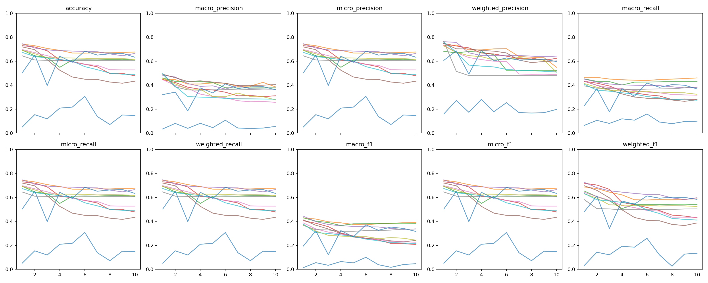

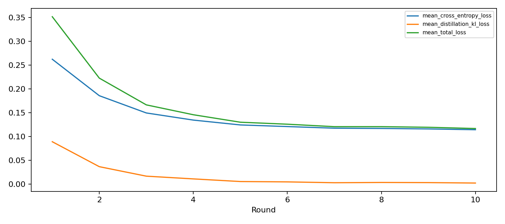

*Bảng — PerFed-SKD · Transformer · **server** · 10 metrics trên `global_test_data.csv` theo từng round*

| Round | accuracy | macro_P | micro_P | weighted_P | macro_R | micro_R | weighted_R | macro_F1 | micro_F1 | weighted_F1 |
|---:|---:|---:|---:|---:|---:|---:|---:|---:|---:|---:|
| 1 | 0.5024 | 0.3214 | 0.5024 | 0.6069 | 0.2292 | 0.5024 | 0.5024 | 0.1936 | 0.5024 | 0.4809 |
| 2 | 0.6520 | 0.3420 | 0.6520 | 0.6860 | 0.3699 | 0.6520 | 0.6520 | 0.3204 | 0.6520 | 0.6121 |
| 3 | 0.3979 | 0.1858 | 0.3979 | 0.4922 | 0.1780 | 0.3979 | 0.3979 | 0.1209 | 0.3979 | 0.3403 |
| 4 | 0.6419 | 0.3768 | 0.6419 | 0.6887 | 0.3712 | 0.6419 | 0.6419 | 0.3229 | 0.6419 | 0.5695 |
| 5 | 0.5908 | 0.3350 | 0.5908 | 0.6028 | 0.3079 | 0.5908 | 0.5908 | 0.2701 | 0.5908 | 0.5431 |
| 6 | 0.6840 | 0.4106 | 0.6840 | 0.6266 | 0.4181 | 0.6840 | 0.6840 | 0.3708 | 0.6840 | 0.6120 |
| 7 | 0.6510 | 0.3717 | 0.6510 | 0.6093 | 0.3824 | 0.6510 | 0.6510 | 0.3254 | 0.6510 | 0.5930 |
| 8 | 0.6616 | 0.3859 | 0.6616 | 0.6139 | 0.4048 | 0.6616 | 0.6616 | 0.3521 | 0.6616 | 0.6012 |
| 9 | 0.6655 | 0.3882 | 0.6655 | 0.6157 | 0.3998 | 0.6655 | 0.6655 | 0.3407 | 0.6655 | 0.5993 |
| 10 | 0.6328 | 0.3622 | 0.6328 | 0.5971 | 0.3687 | 0.6328 | 0.6328 | 0.3157 | 0.6328 | 0.5831 |

*Bảng — PerFed-SKD · Transformer · **trung bình 10 client** · 10 metrics trên `global_test_data.csv` theo từng round*

| Round | accuracy | macro_P | micro_P | weighted_P | macro_R | micro_R | weighted_R | macro_F1 | micro_F1 | weighted_F1 |
|---:|---:|---:|---:|---:|---:|---:|---:|---:|---:|---:|
| 1 | 0.6388 | 0.4262 | 0.6388 | 0.6816 | 0.3945 | 0.6388 | 0.6388 | 0.3634 | 0.6388 | 0.5994 |
| 2 | 0.6235 | 0.3898 | 0.6235 | 0.6399 | 0.3762 | 0.6235 | 0.6235 | 0.3319 | 0.6235 | 0.5750 |
| 3 | 0.5959 | 0.3518 | 0.5959 | 0.5956 | 0.3588 | 0.5959 | 0.5959 | 0.3106 | 0.5959 | 0.5440 |
| 4 | 0.5732 | 0.3466 | 0.5732 | 0.5945 | 0.3474 | 0.5732 | 0.5732 | 0.2958 | 0.5732 | 0.5140 |
| 5 | 0.5671 | 0.3339 | 0.5671 | 0.5770 | 0.3405 | 0.5671 | 0.5671 | 0.2855 | 0.5671 | 0.5000 |
| 6 | 0.5650 | 0.3279 | 0.5650 | 0.5660 | 0.3398 | 0.5650 | 0.5650 | 0.2823 | 0.5650 | 0.4943 |
| 7 | 0.5419 | 0.3173 | 0.5419 | 0.5344 | 0.3296 | 0.5419 | 0.5419 | 0.2718 | 0.5419 | 0.4736 |
| 8 | 0.5197 | 0.3108 | 0.5197 | 0.5286 | 0.3220 | 0.5197 | 0.5197 | 0.2624 | 0.5197 | 0.4460 |
| 9 | 0.5248 | 0.3138 | 0.5248 | 0.5265 | 0.3225 | 0.5248 | 0.5248 | 0.2633 | 0.5248 | 0.4528 |
| 10 | 0.5250 | 0.3090 | 0.5250 | 0.5128 | 0.3228 | 0.5250 | 0.5250 | 0.2627 | 0.5250 | 0.4545 |

> Tại round 10, accuracy giữa 10 client trải từ **0.1483** đến **0.6765** (độ lệch chuẩn 0.1478). Trung bình che mất khoảng cách này — xem [biểu đồ phân tán](#phân-tán-giữa-các-client).

#### PerFed-SKD — 10 client CNN-1D

- Thư mục run: [`perfed_skd/10_clients_cnn1d/task10_perfed_skd_10c_cnn1d`](../perfed_skd/10_clients_cnn1d/task10_perfed_skd_10c_cnn1d)
- Thời gian chạy: **24.3 phút** trên 2×T4 · Truyền thông 10 round: **9.978 MiB**

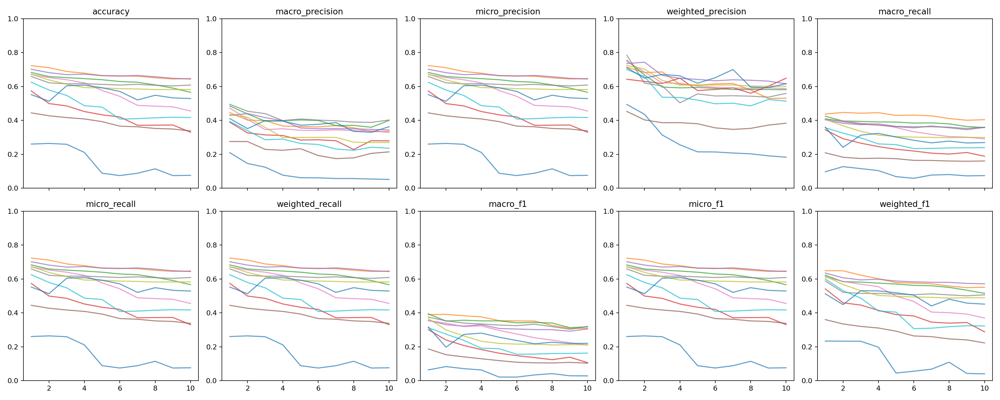

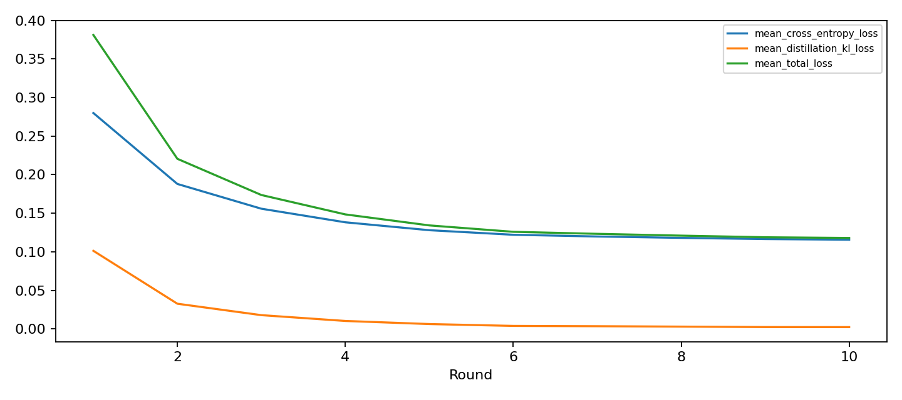

*Bảng — PerFed-SKD · CNN-1D · **server** · 10 metrics trên `global_test_data.csv` theo từng round*

| Round | accuracy | macro_P | micro_P | weighted_P | macro_R | micro_R | weighted_R | macro_F1 | micro_F1 | weighted_F1 |
|---:|---:|---:|---:|---:|---:|---:|---:|---:|---:|---:|
| 1 | 0.5520 | 0.4105 | 0.5520 | 0.7103 | 0.3592 | 0.5520 | 0.5520 | 0.3163 | 0.5520 | 0.5122 |
| 2 | 0.5128 | 0.3516 | 0.5128 | 0.6491 | 0.2407 | 0.5128 | 0.5128 | 0.1974 | 0.5128 | 0.4483 |
| 3 | 0.6042 | 0.3990 | 0.6042 | 0.6714 | 0.3127 | 0.6042 | 0.6042 | 0.2721 | 0.6042 | 0.5304 |
| 4 | 0.6079 | 0.3958 | 0.6079 | 0.6628 | 0.3234 | 0.6079 | 0.6079 | 0.2804 | 0.6079 | 0.5292 |
| 5 | 0.5923 | 0.3715 | 0.5923 | 0.6191 | 0.3018 | 0.5923 | 0.5923 | 0.2560 | 0.5923 | 0.5181 |
| 6 | 0.5710 | 0.3768 | 0.5710 | 0.6519 | 0.2827 | 0.5710 | 0.5710 | 0.2368 | 0.5710 | 0.5045 |
| 7 | 0.5206 | 0.3868 | 0.5206 | 0.6999 | 0.2674 | 0.5206 | 0.5206 | 0.2173 | 0.5206 | 0.4405 |
| 8 | 0.5483 | 0.3351 | 0.5483 | 0.5963 | 0.2778 | 0.5483 | 0.5483 | 0.2266 | 0.5483 | 0.4807 |
| 9 | 0.5327 | 0.3298 | 0.5327 | 0.5934 | 0.2667 | 0.5327 | 0.5327 | 0.2189 | 0.5327 | 0.4573 |
| 10 | 0.5286 | 0.3625 | 0.5286 | 0.6167 | 0.2693 | 0.5286 | 0.5286 | 0.2203 | 0.5286 | 0.4514 |

*Bảng — PerFed-SKD · CNN-1D · **trung bình 10 client** · 10 metrics trên `global_test_data.csv` theo từng round*

| Round | accuracy | macro_P | micro_P | weighted_P | macro_R | micro_R | weighted_R | macro_F1 | micro_F1 | weighted_F1 |
|---:|---:|---:|---:|---:|---:|---:|---:|---:|---:|---:|
| 1 | 0.6011 | 0.4030 | 0.6011 | 0.6750 | 0.3495 | 0.6011 | 0.6011 | 0.3096 | 0.6011 | 0.5454 |
| 2 | 0.5732 | 0.3645 | 0.5732 | 0.6228 | 0.3310 | 0.5732 | 0.5732 | 0.2814 | 0.5732 | 0.5069 |
| 3 | 0.5588 | 0.3307 | 0.5588 | 0.5663 | 0.3162 | 0.5588 | 0.5588 | 0.2640 | 0.5588 | 0.4897 |
| 4 | 0.5387 | 0.3111 | 0.5387 | 0.5410 | 0.3065 | 0.5387 | 0.5387 | 0.2514 | 0.5387 | 0.4680 |
| 5 | 0.5141 | 0.3013 | 0.5141 | 0.5301 | 0.2939 | 0.5141 | 0.5141 | 0.2348 | 0.5141 | 0.4373 |
| 6 | 0.4959 | 0.2950 | 0.4959 | 0.5236 | 0.2843 | 0.4959 | 0.4959 | 0.2245 | 0.4959 | 0.4194 |
| 7 | 0.4868 | 0.2873 | 0.4868 | 0.5233 | 0.2841 | 0.4868 | 0.4868 | 0.2230 | 0.4868 | 0.4101 |
| 8 | 0.4845 | 0.2765 | 0.4845 | 0.5134 | 0.2788 | 0.4845 | 0.4845 | 0.2163 | 0.4845 | 0.4093 |
| 9 | 0.4763 | 0.2816 | 0.4763 | 0.5161 | 0.2743 | 0.4763 | 0.4763 | 0.2086 | 0.4763 | 0.3987 |
| 10 | 0.4663 | 0.2860 | 0.4663 | 0.5205 | 0.2732 | 0.4663 | 0.4663 | 0.2071 | 0.4663 | 0.3874 |

> Tại round 10, accuracy giữa 10 client trải từ **0.0758** đến **0.6466** (độ lệch chuẩn 0.1725). Trung bình che mất khoảng cách này — xem [biểu đồ phân tán](#phân-tán-giữa-các-client).

---

## 5. FedCAPS

### 5.1. Bài báo

- **Tên:** Permutation-Invariant Representation Learning for Robust and Privacy-Preserving Feature Selection (FedCAPS)
- **Tác giả:** Rui Liu, Tao Zhe, Yanjie Fu, Feng Xia, Ted Senator, Dongjie Wang
- **Năm:** 2025 — *mã arXiv 2510 = tháng 10/2025*
- **Nơi xuất bản:** arXiv:2510.05535v3 (bản mở rộng của CAPS)
- **File trong repo:** [`permutation_feature_importance/2510.05535v3.md`](../permutation_feature_importance/2510.05535v3.md)

### 5.2. Quy trình huấn luyện của bài báo gốc

Đây là bài **chọn đặc trưng**, không phải bài huấn luyện classifier liên kết.
Khung CAPS tập trung được mở rộng thành FedCAPS liên kết. Quy trình gốc:

1. **Thu thập record.** Mỗi client dùng một agent RL (MARLFS) duyệt không gian
   feature, sinh các bản ghi `(f_i, v_i)` = (chỉ số feature của subset, hiệu năng
   downstream tương ứng). Chỉ **chỉ số feature + điểm số** rời khỏi client, dữ
   liệu thô không bao giờ được chia sẻ.
2. **Nhúng bất biến hoán vị.** Server huấn luyện encoder–decoder: encoder dùng
   **ISAB** (Induced Set Attention Block, 2 tầng, `M` inducing point) để mọi hoán
   vị của cùng một subset cho ra cùng một embedding; decoder dùng **PMA** (Pooling
   by Multihead Attention với `K` seed vector) tái tạo lại chuỗi chỉ số. Tối ưu
   bằng negative log-likelihood (Eq. 9).
3. **Tìm kiếm đa mục tiêu bằng PPO.** Chọn top-K record làm search seed, agent
   actor–critic dịch chuyển embedding `E → E⁺`, decoder giải mã ra subset ứng
   viên. Reward cân bằng hiệu năng downstream và độ ngắn của subset
   (`λ` là hệ số đánh đổi).
4. **Phản hồi có trọng số theo cỡ mẫu.** Server phát subset ứng viên xuống toàn
   bộ client; mỗi client trả về điểm `v_c` trên dữ liệu cục bộ; server tổng hợp
   `v̂ = Σ W_c·v_c` với `W_c = |D_c| / Σ|D_j|`. Subset có `v̂` cao nhất là `f*`.

Kết quả của bài báo là **một feature subset**, còn classifier chỉ đóng vai trò
hàm đánh giá downstream.

### 5.3. Bản build lại — giữ gì, đổi gì

| Thành phần | Bài gốc | Bản build lại | Đánh giá |
|---|---|---|---|
| Bài toán | chọn đặc trưng tổng quát | chọn đặc trưng cho IDS CICIoT2023 | Giữ nguyên khung |
| Thu thập record | MARLFS trên client | MARLFS 300 epoch/client | Giữ nguyên |
| Tăng cường hoán vị | có | 25 hoán vị/record | Giữ nguyên |
| Encoder | ISAB ×2, inducing points | ISAB ×2, 4 head, `d`=128, 32 inducing point | Giữ nguyên |
| Decoder | PMA + rFF | PMA 32 seed vector + rFF | Giữ nguyên |
| Tìm kiếm | PPO actor–critic | PPO, `λ`=0,1, clip 0,2, 10 search epoch | Giữ nguyên |
| Phản hồi client | có trọng số theo cỡ mẫu | có trọng số theo cỡ mẫu, **5-fold CV tất định** | Làm chặt lại |
| Downstream classifier | mô hình đánh giá bất kỳ | **GRU / Transformer / CNN-1D**, 10 round | **Bổ sung** |
| Tổng hợp classifier | không có trong bài | **không FedAvg classifier** | Giữ nguyên tinh thần |

**Phần bổ sung lớn nhất:** bài gốc dừng ở việc chọn ra `f*`. Để so sánh được với
bốn phương pháp còn lại, bản build lại nối thêm một pha huấn luyện: sau khi chốt
subset, **mỗi client huấn luyện classifier personalized 10 round liên tiếp** trên
100% dữ liệu cục bộ, state giữ qua round, không FedAvg. Vì vậy cột `server` được
ghi `not_applicable` — state server của FedCAPS là encoder/decoder/actor/critic,
không phát logits 34 lớp.

**Search pool** lấy tối đa 100.000 dòng/client, phân tầng độc lập, và **không bao
giờ** chứa dữ liệu từ `global_test_data.csv`.

### 5.4. Có dùng được cho mô hình không đồng nhất không?

**Kết luận: **Có** — hỗ trợ tốt cả hai loại.**

FedCAPS là phương pháp duy nhất trong năm phương pháp mà **không có bất kỳ phép
cộng tham số nào**. Thứ đi từ client lên server chỉ là:

```
(chỉ số feature của subset, điểm hiệu năng downstream)
```

Server không bao giờ nhìn thấy tham số mô hình. Vì vậy:

- **Khác kích thước mô hình:** có. Client A dùng model 10K tham số, client B dùng
  100K tham số — không ảnh hưởng gì, vì cả hai chỉ trả về một con số hiệu năng.
- **Khác loại mô hình:** có. Client A dùng GRU, client B dùng CNN-1D, client C
  dùng XGBoost — vẫn chạy được. Trong bản build lại, `config.json` còn có sẵn
  trường `client_models` ánh xạ từng client sang một họ mô hình, hạ tầng đã sẵn
  sàng cho cấu hình dị thể.

**Ràng buộc thật sự** của FedCAPS không nằm ở mô hình mà ở **không gian feature**:
mọi client phải mô tả feature bằng cùng một hệ chỉ số. Nếu client A có 25 feature
còn client B có 40 feature khác nhau thì chỉ số không so được.

### 5.5. Kết quả đo được

#### FedCAPS — 10 client GRU

- Thư mục run: [`permutation_feature_importance/10_clients_gru/task10_fedcaps_10c_gru`](../permutation_feature_importance/10_clients_gru/task10_fedcaps_10c_gru)
- Thời gian chạy: **191.8 phút** trên 2×T4 · Truyền thông 10 round: **0.135 MiB**

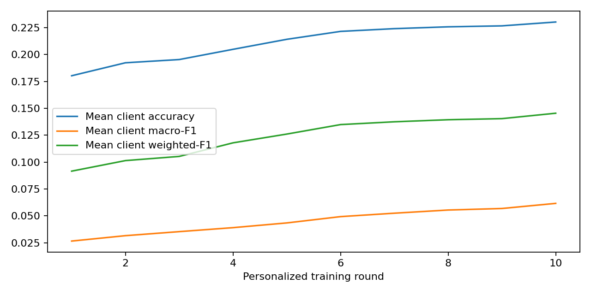

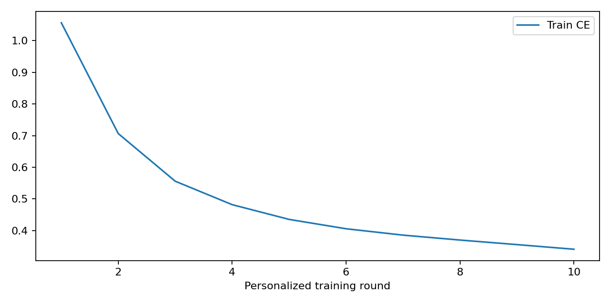

*Bảng — FedCAPS · GRU · **trung bình 10 client** · 10 metrics trên `global_test_data.csv` theo từng round*

| Round | accuracy | macro_P | micro_P | weighted_P | macro_R | micro_R | weighted_R | macro_F1 | micro_F1 | weighted_F1 |
|---:|---:|---:|---:|---:|---:|---:|---:|---:|---:|---:|
| 1 | 0.1803 | 0.0243 | 0.1803 | 0.0822 | 0.0627 | 0.1803 | 0.1803 | 0.0266 | 0.1803 | 0.0916 |
| 2 | 0.1924 | 0.0294 | 0.1924 | 0.0940 | 0.0704 | 0.1924 | 0.1924 | 0.0316 | 0.1924 | 0.1014 |
| 3 | 0.1954 | 0.0309 | 0.1954 | 0.0943 | 0.0772 | 0.1954 | 0.1954 | 0.0354 | 0.1954 | 0.1053 |
| 4 | 0.2049 | 0.0359 | 0.2049 | 0.1141 | 0.0816 | 0.2049 | 0.2049 | 0.0391 | 0.2049 | 0.1179 |
| 5 | 0.2142 | 0.0456 | 0.2142 | 0.1224 | 0.0857 | 0.2142 | 0.2142 | 0.0435 | 0.2142 | 0.1261 |
| 6 | 0.2216 | 0.0452 | 0.2216 | 0.1174 | 0.0927 | 0.2216 | 0.2216 | 0.0493 | 0.2216 | 0.1349 |
| 7 | 0.2241 | 0.0486 | 0.2241 | 0.1195 | 0.0982 | 0.2241 | 0.2241 | 0.0525 | 0.2241 | 0.1375 |
| 8 | 0.2258 | 0.0507 | 0.2258 | 0.1212 | 0.1027 | 0.2258 | 0.2258 | 0.0555 | 0.2258 | 0.1394 |
| 9 | 0.2267 | 0.0519 | 0.2267 | 0.1221 | 0.1056 | 0.2267 | 0.2267 | 0.0569 | 0.2267 | 0.1404 |
| 10 | 0.2303 | 0.0539 | 0.2303 | 0.1256 | 0.1124 | 0.2303 | 0.2303 | 0.0616 | 0.2303 | 0.1455 |

> Tại round 10, accuracy giữa 10 client trải từ **0.0021** đến **0.4527** (độ lệch chuẩn 0.1365). Trung bình che mất khoảng cách này — xem [biểu đồ phân tán](#phân-tán-giữa-các-client).

#### FedCAPS — 10 client Transformer

- Thư mục run: [`permutation_feature_importance/10_clients_transformer/task10_fedcaps_10c_transformer`](../permutation_feature_importance/10_clients_transformer/task10_fedcaps_10c_transformer)
- Thời gian chạy: **403.6 phút** trên 2×T4 · Truyền thông 10 round: **0.141 MiB**

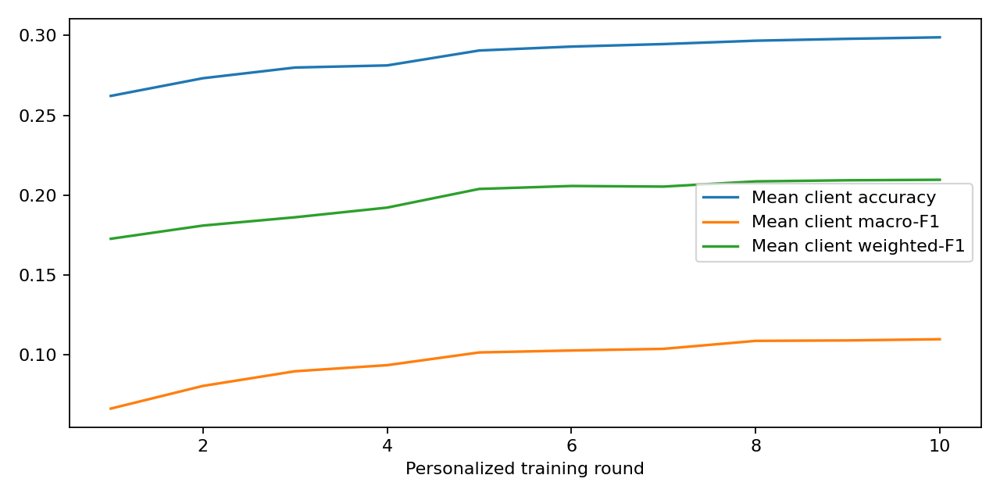

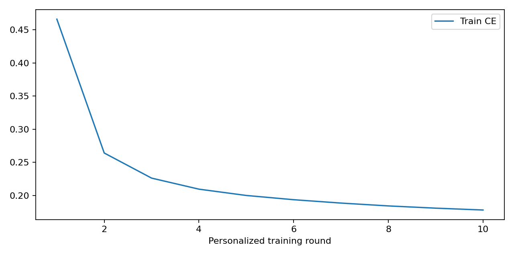

*Bảng — FedCAPS · Transformer · **trung bình 10 client** · 10 metrics trên `global_test_data.csv` theo từng round*

| Round | accuracy | macro_P | micro_P | weighted_P | macro_R | micro_R | weighted_R | macro_F1 | micro_F1 | weighted_F1 |
|---:|---:|---:|---:|---:|---:|---:|---:|---:|---:|---:|
| 1 | 0.2621 | 0.0620 | 0.2621 | 0.1549 | 0.1163 | 0.2621 | 0.2621 | 0.0665 | 0.2621 | 0.1727 |
| 2 | 0.2732 | 0.0761 | 0.2732 | 0.1579 | 0.1366 | 0.2732 | 0.2732 | 0.0806 | 0.2732 | 0.1810 |
| 3 | 0.2799 | 0.0826 | 0.2799 | 0.1631 | 0.1506 | 0.2799 | 0.2799 | 0.0898 | 0.2799 | 0.1862 |
| 4 | 0.2812 | 0.0876 | 0.2812 | 0.1701 | 0.1553 | 0.2812 | 0.2812 | 0.0936 | 0.2812 | 0.1922 |
| 5 | 0.2905 | 0.0926 | 0.2905 | 0.1824 | 0.1630 | 0.2905 | 0.2905 | 0.1016 | 0.2905 | 0.2039 |
| 6 | 0.2930 | 0.0934 | 0.2930 | 0.1831 | 0.1677 | 0.2930 | 0.2930 | 0.1028 | 0.2930 | 0.2057 |
| 7 | 0.2945 | 0.0949 | 0.2945 | 0.1816 | 0.1700 | 0.2945 | 0.2945 | 0.1038 | 0.2945 | 0.2054 |
| 8 | 0.2967 | 0.0991 | 0.2967 | 0.1854 | 0.1751 | 0.2967 | 0.2967 | 0.1088 | 0.2967 | 0.2086 |
| 9 | 0.2978 | 0.0980 | 0.2978 | 0.1849 | 0.1777 | 0.2978 | 0.2978 | 0.1091 | 0.2978 | 0.2093 |
| 10 | 0.2988 | 0.0999 | 0.2988 | 0.1876 | 0.1785 | 0.2988 | 0.2988 | 0.1099 | 0.2988 | 0.2096 |

> Tại round 10, accuracy giữa 10 client trải từ **0.0122** đến **0.5796** (độ lệch chuẩn 0.1717). Trung bình che mất khoảng cách này — xem [biểu đồ phân tán](#phân-tán-giữa-các-client).

#### FedCAPS — 10 client CNN-1D

- Thư mục run: [`permutation_feature_importance/10_clients_cnn1d/task10_fedcaps_10c_cnn1d`](../permutation_feature_importance/10_clients_cnn1d/task10_fedcaps_10c_cnn1d)
- Thời gian chạy: **197.7 phút** trên 2×T4 · Truyền thông 10 round: **0.135 MiB**

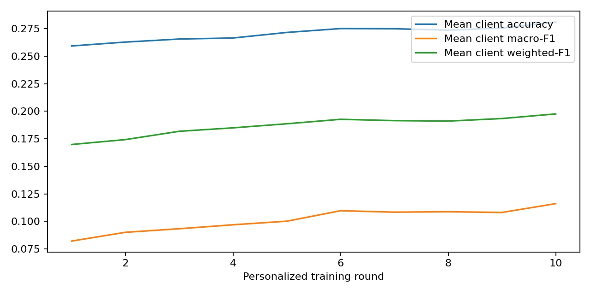

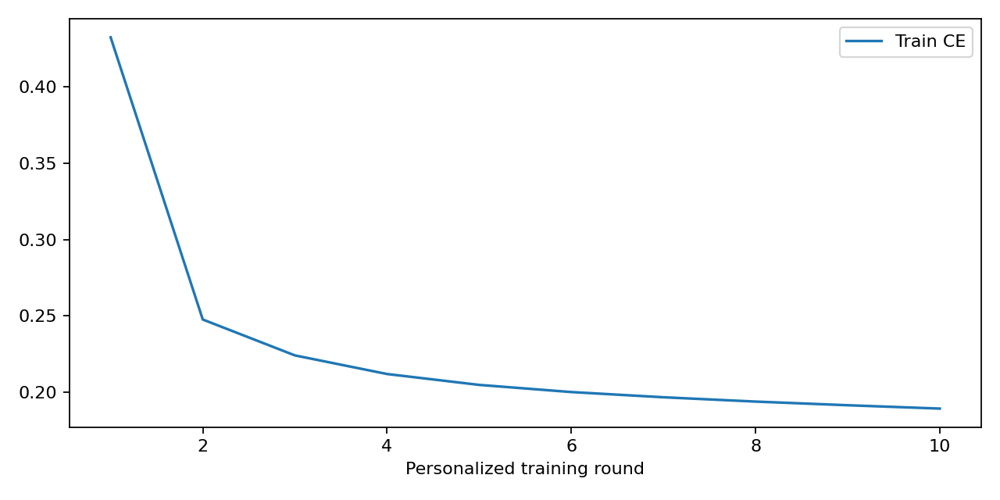

*Bảng — FedCAPS · CNN-1D · **trung bình 10 client** · 10 metrics trên `global_test_data.csv` theo từng round*

| Round | accuracy | macro_P | micro_P | weighted_P | macro_R | micro_R | weighted_R | macro_F1 | micro_F1 | weighted_F1 |
|---:|---:|---:|---:|---:|---:|---:|---:|---:|---:|---:|
| 1 | 0.2593 | 0.0778 | 0.2593 | 0.1496 | 0.1425 | 0.2593 | 0.2593 | 0.0822 | 0.2593 | 0.1698 |
| 2 | 0.2628 | 0.0861 | 0.2628 | 0.1532 | 0.1517 | 0.2628 | 0.2628 | 0.0901 | 0.2628 | 0.1743 |
| 3 | 0.2656 | 0.0957 | 0.2656 | 0.1678 | 0.1572 | 0.2656 | 0.2656 | 0.0934 | 0.2656 | 0.1818 |
| 4 | 0.2665 | 0.0986 | 0.2665 | 0.1772 | 0.1609 | 0.2665 | 0.2665 | 0.0970 | 0.2665 | 0.1849 |
| 5 | 0.2715 | 0.0982 | 0.2715 | 0.1711 | 0.1671 | 0.2715 | 0.2715 | 0.1002 | 0.2715 | 0.1886 |
| 6 | 0.2751 | 0.1036 | 0.2751 | 0.1739 | 0.1752 | 0.2751 | 0.2751 | 0.1097 | 0.2751 | 0.1927 |
| 7 | 0.2749 | 0.1003 | 0.2749 | 0.1753 | 0.1727 | 0.2749 | 0.2749 | 0.1084 | 0.2749 | 0.1915 |
| 8 | 0.2736 | 0.1047 | 0.2736 | 0.1729 | 0.1736 | 0.2736 | 0.2736 | 0.1088 | 0.2736 | 0.1911 |
| 9 | 0.2755 | 0.1093 | 0.2755 | 0.1788 | 0.1729 | 0.2755 | 0.2755 | 0.1081 | 0.2755 | 0.1934 |
| 10 | 0.2810 | 0.1093 | 0.2810 | 0.1775 | 0.1826 | 0.2810 | 0.2810 | 0.1162 | 0.2810 | 0.1976 |

> Tại round 10, accuracy giữa 10 client trải từ **0.0465** đến **0.5153** (độ lệch chuẩn 0.1421). Trung bình che mất khoảng cách này — xem [biểu đồ phân tán](#phân-tán-giữa-các-client).

---

## 6. pFedES

### 6.1. Bài báo

- **Tên:** pFedES: Generalized Proxy Feature Extractor Sharing for Model Heterogeneous Personalized Federated Learning
- **Tác giả:** Liping Yi, Han Yu, Chao Ren, Gang Wang, Xiaoguang Liu, Xiaoxiao Li
- **Năm:** ~2024 — *tham chiếu mới nhất trong bài là 2024 — cần đối chiếu bản gốc*
- **Nơi xuất bản:** định dạng trích dẫn AAAI (bản .md không ghi số kỷ yếu)
- **File trong repo:** [`pfedes/00121-YiL.md`](../pfedes/00121-YiL.md)

### 6.2. Quy trình huấn luyện của bài báo gốc

Bài báo giải bài toán **model-heterogeneous** personalized FL: mỗi client có thể
mang một kiến trúc khác nhau. Quy trình gốc mỗi round:

1. Server phát **proxy feature extractor đồng nhất** `G(θ^{t−1})` — một CNN nhỏ
   hai tầng conv với `padding = same`, bảo đảm **kích thước vào bằng kích thước
   ra**, nên nó cắm được trước bất kỳ model cục bộ nào.
2. **Bước ①: đóng băng proxy, huấn luyện model dị thể.** Client đưa dữ liệu gốc
   `x` qua proxy để có `x̂ = G(θ^{t−1}; x)`, rồi cho **cả `x̂` và `x`** qua model
   cục bộ `F_k(ω_k)` được hai dự đoán `ŷ₁, ŷ₂`. Loss tổng hợp là trung bình có
   trọng số hai CE: `ℓ_ω = μ·ℓ₁ + (1−μ)·ℓ₂` với `μ ∈ (0; 0,5]` (Eq. 6). Chỉ `ω_k`
   được cập nhật.
3. **Bước ②: đóng băng model dị thể, huấn luyện proxy.** Dùng `F_k(ω_k^t)` vừa
   cập nhật làm hàm cố định, tính `ŷ = F_k(ω_k^t; G(θ; x))` và CE `ℓ_θ`; chỉ `θ`
   được cập nhật (Eq. 8–10).
4. **Tổng hợp.** Server FedAvg **chỉ proxy extractor**:
   `θ^t = Σ_{k∈S} (n_k/n)·θ_k^t` (Eq. 11).

Model cục bộ dị thể **không bao giờ rời khỏi client**. Chi phí truyền thông chỉ
bằng kích thước proxy. Suy luận cuối cùng dùng model cục bộ cá nhân hoá.

### 6.3. Bản build lại — giữ gì, đổi gì

| Thành phần | Bài gốc | Bản build lại | Đánh giá |
|---|---|---|---|
| Bộ dữ liệu | 3 bộ ảnh benchmark | **CICIoT2023** (dữ liệu bảng 25 chiều) | **Khác** |
| Proxy extractor | CNN 2 tầng conv, `padding=same` | Conv1d 1→8→1, kernel 3, padding 1, ReLU | Giữ nguyên nguyên lý |
| Ràng buộc kích thước | vào = ra | `[B,25] → [B,25]`, đúng **57 tham số** | Giữ nguyên |
| Huấn luyện xen kẽ | ① đóng băng proxy → ② đóng băng model | ① rồi ② trong cùng round | Giữ nguyên |
| Loss bước ① | `μ·ℓ₁ + (1−μ)·ℓ₂` | CE có trọng số trên `x̂` và `x` | Giữ nguyên |
| Tổng hợp | FedAvg **chỉ proxy**, trọng số `n_k/n` | FedAvg chỉ proxy, trọng số `n_k/n` | Giữ nguyên |
| Chọn client | ngẫu nhiên `K` trong `N` | **toàn bộ 10/10 mỗi round** | **Khác (chuẩn hoá)** |
| Số round | tới khi hội tụ | **10** | **Khác (chuẩn hoá)** |

**Điểm cần lưu ý về tính dị thể:** bài gốc thiết kế cho mỗi client một kiến trúc
khác nhau. Bản build lại cho **cả 10 client cùng một kiến trúc** trong mỗi kịch
bản (10 GRU, hoặc 10 Transformer, hoặc 10 CNN-1D) để giữ tính so sánh được với
bốn phương pháp còn lại. Đây là **giới hạn của thiết kế thí nghiệm, không phải
giới hạn của phương pháp** — xem mục khả năng dị thể bên dưới.

### 6.4. Có dùng được cho mô hình không đồng nhất không?

**Kết luận: **Có** — đây chính là mục tiêu thiết kế của bài báo.**

pFedES sinh ra để giải bài toán model-heterogeneous PFL. Cơ chế:

- Thứ duy nhất được FedAvg là **proxy feature extractor 57 tham số**, hoàn toàn
  tách rời model cục bộ.
- Ràng buộc `padding = same` bảo đảm proxy có **đầu vào và đầu ra cùng kích
  thước** (`[B,25] → [B,25]`), nên nó cắm được trước bất kỳ classifier nào nhận
  `[B,25]`.
- Model cục bộ `F_k(ω_k)` **không bao giờ rời khỏi client**, server không cần
  biết kiến trúc của nó.

- **Khác kích thước mô hình:** có, không giới hạn.
- **Khác loại mô hình:** có, miễn là nhận đúng shape đầu vào.

Đây là phương pháp **rẻ nhất** để hỗ trợ dị thể: chi phí truyền thông đo được chỉ
**0,043 MiB cho toàn bộ 10 round** — thấp hơn FD-IDS khoảng **700 lần**.

Trong bản build lại cả 10 client dùng cùng kiến trúc, nên **khả năng dị thể chưa
được kiểm chứng bằng thực nghiệm ở đây**; kết luận trên đến từ cơ chế của phương
pháp, không từ số đo.

### 6.5. Kết quả đo được

#### pFedES — 10 client GRU

- Thư mục run: [`pfedes/10_clients_gru/task10_pfedes_10c_gru`](../pfedes/10_clients_gru/task10_pfedes_10c_gru)
- Thời gian chạy: **37.5 phút** trên 2×T4 · Truyền thông 10 round: **0.043 MiB**

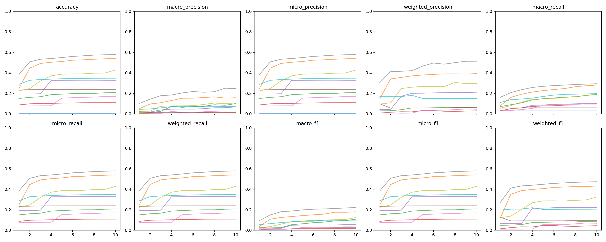

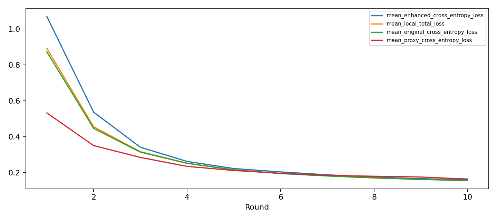

*Bảng — pFedES · GRU · **trung bình 10 client** · 10 metrics trên `global_test_data.csv` theo từng round*

| Round | accuracy | macro_P | micro_P | weighted_P | macro_R | micro_R | weighted_R | macro_F1 | micro_F1 | weighted_F1 |
|---:|---:|---:|---:|---:|---:|---:|---:|---:|---:|---:|
| 1 | 0.1887 | 0.0285 | 0.1887 | 0.0907 | 0.0678 | 0.1887 | 0.1887 | 0.0296 | 0.1887 | 0.0973 |
| 2 | 0.2293 | 0.0371 | 0.2293 | 0.1182 | 0.0905 | 0.2293 | 0.2293 | 0.0442 | 0.2293 | 0.1357 |
| 3 | 0.2459 | 0.0504 | 0.2459 | 0.1482 | 0.1039 | 0.2459 | 0.2459 | 0.0528 | 0.2459 | 0.1488 |
| 4 | 0.2687 | 0.0625 | 0.2687 | 0.1575 | 0.1196 | 0.2687 | 0.2687 | 0.0644 | 0.2687 | 0.1754 |
| 5 | 0.2806 | 0.0660 | 0.2806 | 0.1647 | 0.1293 | 0.2806 | 0.2806 | 0.0701 | 0.2806 | 0.1834 |
| 6 | 0.2846 | 0.0682 | 0.2846 | 0.1683 | 0.1348 | 0.2846 | 0.2846 | 0.0731 | 0.2846 | 0.1859 |
| 7 | 0.2867 | 0.0704 | 0.2867 | 0.1675 | 0.1398 | 0.2867 | 0.2867 | 0.0761 | 0.2867 | 0.1866 |
| 8 | 0.2890 | 0.0760 | 0.2890 | 0.1739 | 0.1444 | 0.2890 | 0.2890 | 0.0805 | 0.2890 | 0.1889 |
| 9 | 0.2909 | 0.0776 | 0.2909 | 0.1753 | 0.1487 | 0.2909 | 0.2909 | 0.0822 | 0.2909 | 0.1916 |
| 10 | 0.2948 | 0.0806 | 0.2948 | 0.1765 | 0.1534 | 0.2948 | 0.2948 | 0.0868 | 0.2948 | 0.1954 |

> Tại round 10, accuracy giữa 10 client trải từ **0.0021** đến **0.5790** (độ lệch chuẩn 0.1758). Trung bình che mất khoảng cách này — xem [biểu đồ phân tán](#phân-tán-giữa-các-client).

#### pFedES — 10 client Transformer

- Thư mục run: [`pfedes/10_clients_transformer/task10_pfedes_10c_transformer`](../pfedes/10_clients_transformer/task10_pfedes_10c_transformer)
- Thời gian chạy: **136.8 phút** trên 2×T4 · Truyền thông 10 round: **0.043 MiB**

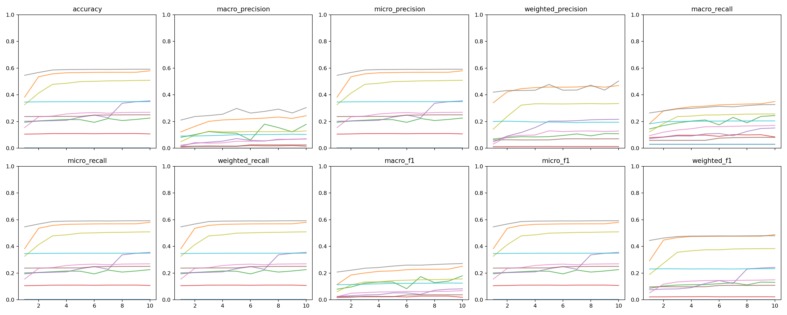

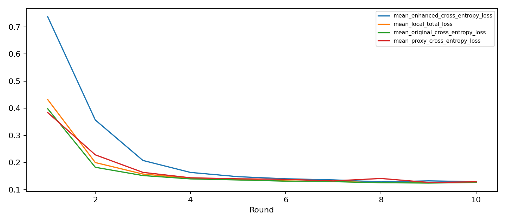

*Bảng — pFedES · Transformer · **trung bình 10 client** · 10 metrics trên `global_test_data.csv` theo từng round*

| Round | accuracy | macro_P | micro_P | weighted_P | macro_R | micro_R | weighted_R | macro_F1 | micro_F1 | weighted_F1 |
|---:|---:|---:|---:|---:|---:|---:|---:|---:|---:|---:|
| 1 | 0.2496 | 0.0615 | 0.2496 | 0.1325 | 0.1230 | 0.2496 | 0.2496 | 0.0663 | 0.2496 | 0.1485 |
| 2 | 0.2852 | 0.0798 | 0.2852 | 0.1627 | 0.1486 | 0.2852 | 0.2852 | 0.0848 | 0.2852 | 0.1833 |
| 3 | 0.2975 | 0.0904 | 0.2975 | 0.1775 | 0.1632 | 0.2975 | 0.2975 | 0.0949 | 0.2975 | 0.1971 |
| 4 | 0.3019 | 0.0923 | 0.3019 | 0.1830 | 0.1677 | 0.3019 | 0.3019 | 0.0983 | 0.3019 | 0.2011 |
| 5 | 0.3063 | 0.1004 | 0.3063 | 0.1959 | 0.1738 | 0.3063 | 0.3063 | 0.1024 | 0.3063 | 0.2057 |
| 6 | 0.3076 | 0.0928 | 0.3076 | 0.1924 | 0.1732 | 0.3076 | 0.3076 | 0.1008 | 0.3076 | 0.2096 |
| 7 | 0.3085 | 0.1057 | 0.3085 | 0.1943 | 0.1792 | 0.3085 | 0.3085 | 0.1098 | 0.3085 | 0.2088 |
| 8 | 0.3186 | 0.1082 | 0.3186 | 0.1983 | 0.1803 | 0.3186 | 0.3186 | 0.1094 | 0.3186 | 0.2186 |
| 9 | 0.3210 | 0.1017 | 0.3210 | 0.1952 | 0.1885 | 0.3210 | 0.3210 | 0.1123 | 0.3210 | 0.2218 |
| 10 | 0.3238 | 0.1137 | 0.3238 | 0.2038 | 0.1898 | 0.3238 | 0.3238 | 0.1186 | 0.3238 | 0.2235 |

> Tại round 10, accuracy giữa 10 client trải từ **0.0021** đến **0.5917** (độ lệch chuẩn 0.1848). Trung bình che mất khoảng cách này — xem [biểu đồ phân tán](#phân-tán-giữa-các-client).

#### pFedES — 10 client CNN-1D

- Thư mục run: [`pfedes/10_clients_cnn1d/task10_pfedes_10c_cnn1d`](../pfedes/10_clients_cnn1d/task10_pfedes_10c_cnn1d)
- Thời gian chạy: **36.6 phút** trên 2×T4 · Truyền thông 10 round: **0.043 MiB**

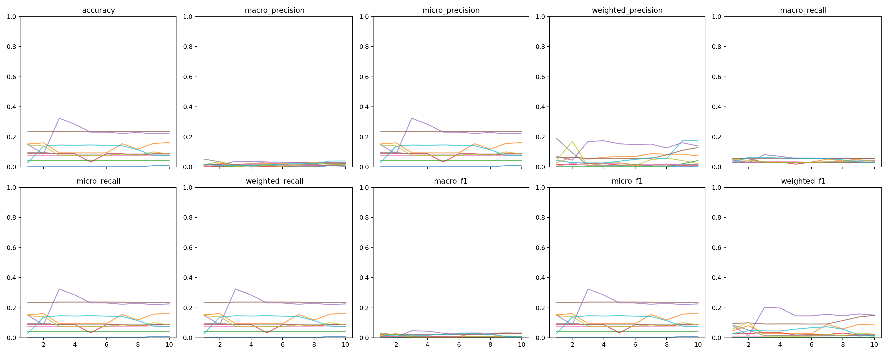

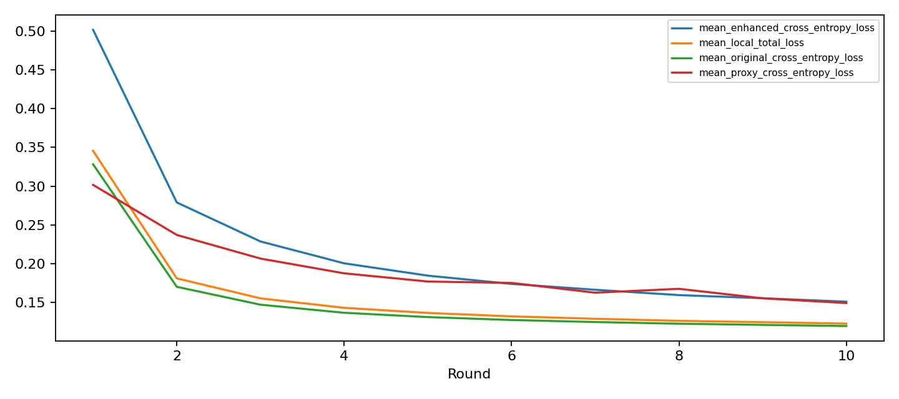

*Bảng — pFedES · CNN-1D · **trung bình 10 client** · 10 metrics trên `global_test_data.csv` theo từng round*

| Round | accuracy | macro_P | micro_P | weighted_P | macro_R | micro_R | weighted_R | macro_F1 | micro_F1 | weighted_F1 |
|---:|---:|---:|---:|---:|---:|---:|---:|---:|---:|---:|
| 1 | 0.1020 | 0.0137 | 0.1020 | 0.0463 | 0.0417 | 0.1020 | 0.1020 | 0.0139 | 0.1020 | 0.0437 |
| 2 | 0.1067 | 0.0151 | 0.1067 | 0.0513 | 0.0431 | 0.1067 | 0.1067 | 0.0138 | 0.1067 | 0.0439 |
| 3 | 0.1176 | 0.0114 | 0.1176 | 0.0361 | 0.0424 | 0.1176 | 0.1176 | 0.0130 | 0.1176 | 0.0444 |
| 4 | 0.1135 | 0.0139 | 0.1135 | 0.0407 | 0.0409 | 0.1135 | 0.1135 | 0.0129 | 0.1135 | 0.0440 |
| 5 | 0.1028 | 0.0154 | 0.1028 | 0.0398 | 0.0378 | 0.1028 | 0.1028 | 0.0115 | 0.1028 | 0.0381 |
| 6 | 0.1080 | 0.0123 | 0.1080 | 0.0386 | 0.0390 | 0.1080 | 0.1080 | 0.0117 | 0.1080 | 0.0395 |
| 7 | 0.1140 | 0.0146 | 0.1140 | 0.0448 | 0.0413 | 0.1140 | 0.1140 | 0.0149 | 0.1140 | 0.0485 |
| 8 | 0.1067 | 0.0150 | 0.1067 | 0.0454 | 0.0397 | 0.1067 | 0.1067 | 0.0136 | 0.1067 | 0.0454 |
| 9 | 0.1096 | 0.0189 | 0.1096 | 0.0645 | 0.0421 | 0.1096 | 0.1096 | 0.0152 | 0.1096 | 0.0493 |
| 10 | 0.1089 | 0.0185 | 0.1089 | 0.0636 | 0.0417 | 0.1089 | 0.1089 | 0.0144 | 0.1089 | 0.0486 |

> Tại round 10, accuracy giữa 10 client trải từ **0.0083** đến **0.2352** (độ lệch chuẩn 0.0709). Trung bình che mất khoảng cách này — xem [biểu đồ phân tán](#phân-tán-giữa-các-client).

---

## 7. ProxyModel

### 7.1. Bài báo

- **Tên:** Lightweight Federated Learning for On-Device Non-Intrusive Load Monitoring
- **Tác giả:** (bản .md không có trang tiêu đề)
- **Năm:** 2025 — *tiền tố năm trong tên file + tham chiếu mới nhất 2024*
- **Nơi xuất bản:** tạp chí IEEE (bản .md chỉ còn từ mục IV trở đi)
- **File trong repo:** [`proxymodel/2025 Lightweight_Federated_Learning_for_On-Device_Non-Intrusive_Load_Monitoring.md`](../proxymodel/2025 Lightweight_Federated_Learning_for_On-Device_Non-Intrusive_Load_Monitoring.md)

### 7.2. Quy trình huấn luyện của bài báo gốc

Bài báo làm NILM (phân tách phụ tải) trên thiết bị đầu cuối tài nguyên thấp.
Quy trình gốc:

1. **NAS tiết kiệm bộ nhớ** tìm kiến trúc CNN-1D riêng cho từng hộ gia đình/thiết
   bị. Không gian tìm kiếm 5 node × 8 toán tử; sau khi tìm xong giữ lại 2 đường
   có tham số kiến trúc lớn nhất mỗi node. Kết quả: **mỗi client một kiến trúc
   personalized khác nhau**.
2. **Proxy model dùng chung** gồm 3 tầng conv kernel 5 và 1 tầng dense — cố ý nhỏ
   để cân bằng giữa chi phí truyền thông và năng lực biểu diễn.
3. **Adaptive mutual learning.** Model personalized và proxy cục bộ được tối ưu
   **đồng thời**, mỗi model vừa học nhãn thật vừa chưng cất lẫn nhau (mutual
   distillation hai chiều, trọng số thích nghi).
4. **Tổng hợp.** Chỉ proxy được FedAvg qua các hộ; model personalized ở lại thiết
   bị. Tri thức toàn cục đi vào model personalized gián tiếp qua proxy.

Bài gốc là bài toán **hồi quy**, đo bằng MAE và SAE, trên hai bộ REFIT và REDD.

> Lưu ý: file `.md` trong repo chỉ còn từ mục IV (Case Studies) trở đi, phần
> phương pháp I–III đã mất. Mô tả trên được ghép từ mục IV, phần Kết luận và
> đặc tả `ARCHITECTURE_AND_OUTPUT_SPEC.md`.

### 7.3. Bản build lại — giữ gì, đổi gì

| Thành phần | Bài gốc | Bản build lại | Đánh giá |
|---|---|---|---|
| Bài toán | **hồi quy** NILM (MAE/SAE) | **phân loại đa lớp** 34 lớp | **Khác về bản chất** |
| Bộ dữ liệu | REFIT, REDD | **CICIoT2023** | **Khác** |
| Model personalized | tìm bằng NAS, mỗi client một kiến trúc | **GRU / Transformer / CNN-1D** cố định | **Khác (bỏ NAS)** |
| Proxy | CNN 3 tầng conv kernel 5 + dense | **CNN-1D 35.874 tham số** dùng chung | Giữ nguyên vai trò |
| Mutual distillation | hai chiều, trọng số thích nghi | hai chiều, trọng số thích nghi | Giữ nguyên |
| Tối ưu đồng thời | có | có (label loss + distillation) | Giữ nguyên |
| Tổng hợp | FedAvg **chỉ proxy** | FedAvg chỉ proxy, trọng số `n_k/n` | Giữ nguyên |
| Fine-tune cuối | có | **1 epoch CE personalized ở round 10** | Giữ nguyên |
| Số round | — | **10** | **Khác (chuẩn hoá)** |

**Thay đổi lớn nhất là bỏ NAS.** Bài gốc lấy tính dị thể từ chính NAS: mỗi hộ gia
đình nhận một kiến trúc riêng. Bản build lại cố định kiến trúc để so sánh được,
nên phần "personalized architecture" của bài gốc **không được tái hiện**. Cơ chế
còn lại — proxy dùng chung + adaptive mutual distillation + FedAvg chỉ proxy —
được giữ đầy đủ.

Trong kịch bản CNN-1D, personalized CNN và proxy CNN là **hai model/state riêng
biệt**, không dùng chung tham số.

### 7.4. Có dùng được cho mô hình không đồng nhất không?

**Kết luận: **Có** — hỗ trợ cả hai loại, và bài gốc thực sự dùng.**

ProxyModel cũng chỉ FedAvg proxy, giống pFedES về nguyên lý, nhưng đi xa hơn ở
chỗ **bài gốc thực sự vận hành trong chế độ dị thể**: NAS sinh ra một kiến trúc
riêng cho từng hộ gia đình, và các kiến trúc này khác nhau cả về số tầng lẫn kích
thước kernel.

- **Khác kích thước mô hình:** có. Adaptive mutual distillation trao đổi qua
  **logits đầu ra**, không qua tham số.
- **Khác loại mô hình:** có, miễn là không gian nhãn giống nhau.

**Khác biệt so với pFedES:** proxy của ProxyModel là một **classifier đầy đủ**
(35.874 tham số) chứ không phải extractor 57 tham số. Nên ProxyModel tốn truyền
thông hơn nhiều (**27,7 MiB** so với 0,043 MiB) nhưng đổi lại server có một model
dùng được ngay — và số liệu bên dưới cho thấy global proxy này là **entity mạnh
nhất trong toàn bộ thí nghiệm**.

Trong bản build lại NAS đã bị bỏ nên cả 10 client dùng cùng kiến trúc; khả năng
dị thể vì thế **cũng chưa được kiểm chứng bằng thực nghiệm ở đây**.

### 7.5. Kết quả đo được

#### ProxyModel — 10 client GRU

- Thư mục run: [`proxymodel/10_clients_gru/task10_proxymodel_10c_gru`](../proxymodel/10_clients_gru/task10_proxymodel_10c_gru)
- Thời gian chạy: **28.9 phút** trên 2×T4 · Truyền thông 10 round: **27.716 MiB**

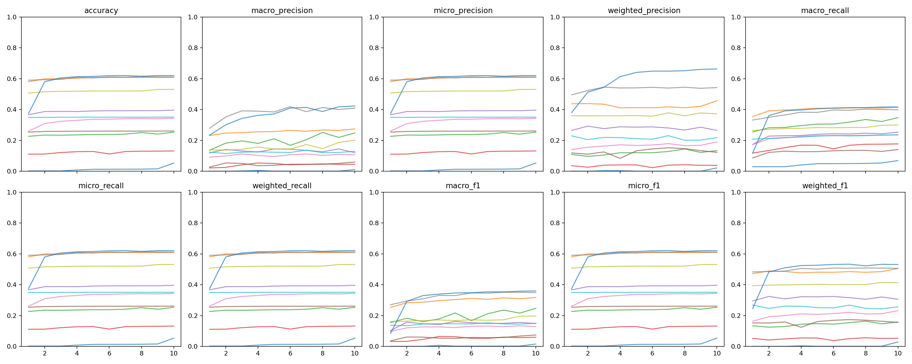

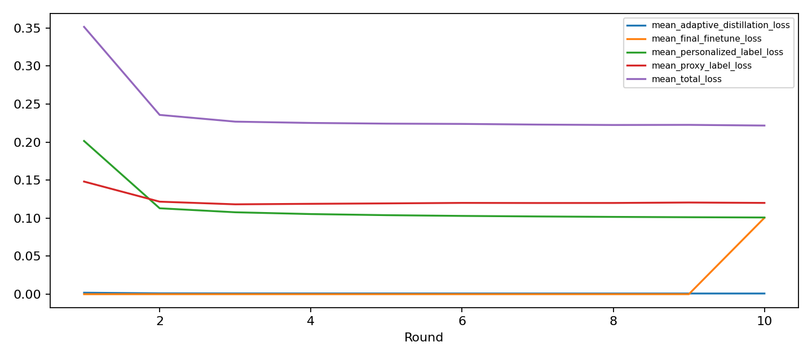

*Bảng — ProxyModel · GRU · **server** · 10 metrics trên `global_test_data.csv` theo từng round*

| Round | accuracy | macro_P | micro_P | weighted_P | macro_R | micro_R | weighted_R | macro_F1 | micro_F1 | weighted_F1 |
|---:|---:|---:|---:|---:|---:|---:|---:|---:|---:|---:|
| 1 | 0.3748 | 0.2337 | 0.3748 | 0.3805 | 0.1185 | 0.3748 | 0.3748 | 0.0851 | 0.3748 | 0.2459 |
| 2 | 0.5800 | 0.3010 | 0.5800 | 0.5128 | 0.3608 | 0.5800 | 0.5800 | 0.2919 | 0.5800 | 0.4823 |
| 3 | 0.6054 | 0.3425 | 0.6054 | 0.5439 | 0.3914 | 0.6054 | 0.6054 | 0.3292 | 0.6054 | 0.5094 |
| 4 | 0.6130 | 0.3623 | 0.6130 | 0.6132 | 0.3976 | 0.6130 | 0.6130 | 0.3390 | 0.6130 | 0.5238 |
| 5 | 0.6150 | 0.3715 | 0.6150 | 0.6404 | 0.4048 | 0.6150 | 0.6150 | 0.3461 | 0.6150 | 0.5259 |
| 6 | 0.6195 | 0.4098 | 0.6195 | 0.6492 | 0.4095 | 0.6195 | 0.6195 | 0.3478 | 0.6195 | 0.5312 |
| 7 | 0.6205 | 0.4136 | 0.6205 | 0.6491 | 0.4121 | 0.6205 | 0.6205 | 0.3536 | 0.6205 | 0.5328 |
| 8 | 0.6157 | 0.3875 | 0.6157 | 0.6517 | 0.4123 | 0.6157 | 0.6157 | 0.3535 | 0.6157 | 0.5219 |
| 9 | 0.6202 | 0.4177 | 0.6202 | 0.6602 | 0.4165 | 0.6202 | 0.6202 | 0.3578 | 0.6202 | 0.5321 |
| 10 | 0.6205 | 0.4231 | 0.6205 | 0.6633 | 0.4165 | 0.6205 | 0.6205 | 0.3593 | 0.6205 | 0.5307 |

*Bảng — ProxyModel · GRU · **trung bình 10 client** · 10 metrics trên `global_test_data.csv` theo từng round*

| Round | accuracy | macro_P | micro_P | weighted_P | macro_R | micro_R | weighted_R | macro_F1 | micro_F1 | weighted_F1 |
|---:|---:|---:|---:|---:|---:|---:|---:|---:|---:|---:|
| 1 | 0.3247 | 0.1168 | 0.3247 | 0.2192 | 0.1995 | 0.3247 | 0.3247 | 0.1243 | 0.3247 | 0.2410 |
| 2 | 0.3360 | 0.1353 | 0.3360 | 0.2208 | 0.2233 | 0.3360 | 0.3360 | 0.1427 | 0.3360 | 0.2451 |
| 3 | 0.3391 | 0.1442 | 0.3391 | 0.2273 | 0.2301 | 0.3391 | 0.3391 | 0.1446 | 0.3391 | 0.2476 |
| 4 | 0.3429 | 0.1432 | 0.3429 | 0.2237 | 0.2376 | 0.3429 | 0.3429 | 0.1516 | 0.3429 | 0.2500 |
| 5 | 0.3450 | 0.1449 | 0.3450 | 0.2272 | 0.2422 | 0.3450 | 0.3450 | 0.1563 | 0.3450 | 0.2528 |
| 6 | 0.3443 | 0.1456 | 0.3443 | 0.2267 | 0.2427 | 0.3443 | 0.3443 | 0.1537 | 0.3443 | 0.2526 |
| 7 | 0.3464 | 0.1499 | 0.3464 | 0.2346 | 0.2465 | 0.3464 | 0.3464 | 0.1573 | 0.3464 | 0.2574 |
| 8 | 0.3481 | 0.1523 | 0.3481 | 0.2284 | 0.2505 | 0.3481 | 0.3481 | 0.1615 | 0.3481 | 0.2542 |
| 9 | 0.3481 | 0.1543 | 0.3481 | 0.2288 | 0.2501 | 0.3481 | 0.3481 | 0.1629 | 0.3481 | 0.2544 |
| 10 | 0.3541 | 0.1606 | 0.3541 | 0.2360 | 0.2573 | 0.3541 | 0.3541 | 0.1684 | 0.3541 | 0.2612 |

> Tại round 10, accuracy giữa 10 client trải từ **0.0534** đến **0.6112** (độ lệch chuẩn 0.1797). Trung bình che mất khoảng cách này — xem [biểu đồ phân tán](#phân-tán-giữa-các-client).

#### ProxyModel — 10 client Transformer

- Thư mục run: [`proxymodel/10_clients_transformer/task10_proxymodel_10c_transformer`](../proxymodel/10_clients_transformer/task10_proxymodel_10c_transformer)
- Thời gian chạy: **77.8 phút** trên 2×T4 · Truyền thông 10 round: **27.716 MiB**

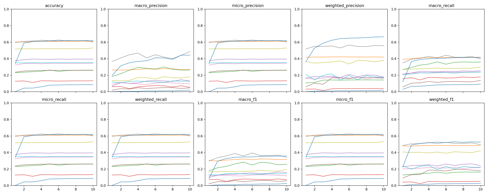

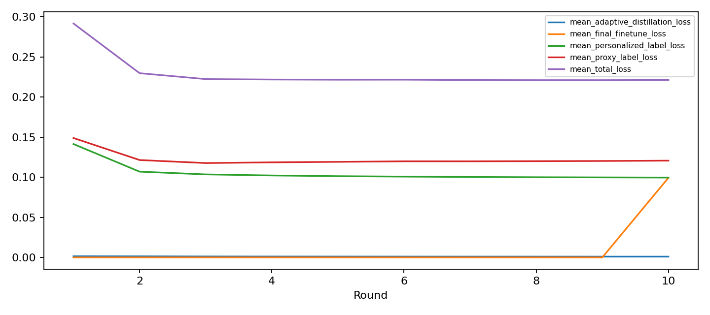

*Bảng — ProxyModel · Transformer · **server** · 10 metrics trên `global_test_data.csv` theo từng round*

| Round | accuracy | macro_P | micro_P | weighted_P | macro_R | micro_R | weighted_R | macro_F1 | micro_F1 | weighted_F1 |
|---:|---:|---:|---:|---:|---:|---:|---:|---:|---:|---:|
| 1 | 0.3430 | 0.1970 | 0.3430 | 0.3661 | 0.1182 | 0.3430 | 0.3430 | 0.0884 | 0.3430 | 0.2265 |
| 2 | 0.5895 | 0.3145 | 0.5895 | 0.5276 | 0.3648 | 0.5895 | 0.5895 | 0.2963 | 0.5895 | 0.4902 |
| 3 | 0.6057 | 0.3505 | 0.6057 | 0.5883 | 0.3895 | 0.6057 | 0.6057 | 0.3268 | 0.6057 | 0.5093 |
| 4 | 0.6110 | 0.3672 | 0.6110 | 0.6228 | 0.3999 | 0.6110 | 0.6110 | 0.3419 | 0.6110 | 0.5179 |
| 5 | 0.6153 | 0.3753 | 0.6153 | 0.6435 | 0.4024 | 0.6153 | 0.6153 | 0.3463 | 0.6153 | 0.5254 |
| 6 | 0.6151 | 0.4106 | 0.6151 | 0.6485 | 0.4064 | 0.6151 | 0.6151 | 0.3463 | 0.6151 | 0.5201 |
| 7 | 0.6195 | 0.4087 | 0.6195 | 0.6507 | 0.4123 | 0.6195 | 0.6195 | 0.3545 | 0.6195 | 0.5292 |
| 8 | 0.6171 | 0.3911 | 0.6171 | 0.6549 | 0.4135 | 0.6171 | 0.6171 | 0.3551 | 0.6171 | 0.5229 |
| 9 | 0.6197 | 0.4432 | 0.6197 | 0.6619 | 0.4160 | 0.6197 | 0.6197 | 0.3563 | 0.6197 | 0.5291 |
| 10 | 0.6185 | 0.4425 | 0.6185 | 0.6651 | 0.4138 | 0.6185 | 0.6185 | 0.3572 | 0.6185 | 0.5251 |

*Bảng — ProxyModel · Transformer · **trung bình 10 client** · 10 metrics trên `global_test_data.csv` theo từng round*

| Round | accuracy | macro_P | micro_P | weighted_P | macro_R | micro_R | weighted_R | macro_F1 | micro_F1 | weighted_F1 |
|---:|---:|---:|---:|---:|---:|---:|---:|---:|---:|---:|
| 1 | 0.3360 | 0.1316 | 0.3360 | 0.2033 | 0.2153 | 0.3360 | 0.3360 | 0.1388 | 0.3360 | 0.2297 |
| 2 | 0.3470 | 0.1459 | 0.3470 | 0.2058 | 0.2369 | 0.3470 | 0.3470 | 0.1527 | 0.3470 | 0.2352 |
| 3 | 0.3485 | 0.1513 | 0.3485 | 0.2118 | 0.2440 | 0.3485 | 0.3485 | 0.1576 | 0.3485 | 0.2396 |
| 4 | 0.3532 | 0.1650 | 0.3532 | 0.2273 | 0.2529 | 0.3532 | 0.3532 | 0.1674 | 0.3532 | 0.2513 |
| 5 | 0.3568 | 0.1600 | 0.3568 | 0.2165 | 0.2546 | 0.3568 | 0.3568 | 0.1681 | 0.3568 | 0.2465 |
| 6 | 0.3561 | 0.1640 | 0.3561 | 0.2245 | 0.2560 | 0.3561 | 0.3561 | 0.1699 | 0.3561 | 0.2494 |
| 7 | 0.3565 | 0.1674 | 0.3565 | 0.2222 | 0.2553 | 0.3565 | 0.3565 | 0.1712 | 0.3565 | 0.2491 |
| 8 | 0.3574 | 0.1599 | 0.3574 | 0.2263 | 0.2583 | 0.3574 | 0.3574 | 0.1703 | 0.3574 | 0.2524 |
| 9 | 0.3578 | 0.1641 | 0.3578 | 0.2261 | 0.2584 | 0.3578 | 0.3578 | 0.1687 | 0.3578 | 0.2522 |
| 10 | 0.3572 | 0.1670 | 0.3572 | 0.2237 | 0.2609 | 0.3572 | 0.3572 | 0.1685 | 0.3572 | 0.2494 |

> Tại round 10, accuracy giữa 10 client trải từ **0.0853** đến **0.6102** (độ lệch chuẩn 0.1726). Trung bình che mất khoảng cách này — xem [biểu đồ phân tán](#phân-tán-giữa-các-client).

#### ProxyModel — 10 client CNN-1D

- Thư mục run: [`proxymodel/10_clients_cnn1d/task10_proxymodel_10c_cnn1d`](../proxymodel/10_clients_cnn1d/task10_proxymodel_10c_cnn1d)
- Thời gian chạy: **30.1 phút** trên 2×T4 · Truyền thông 10 round: **27.716 MiB**

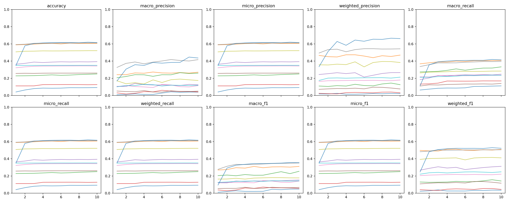

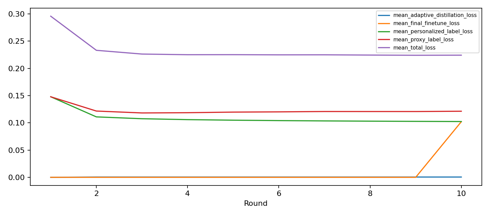

*Bảng — ProxyModel · CNN-1D · **server** · 10 metrics trên `global_test_data.csv` theo từng round*

| Round | accuracy | macro_P | micro_P | weighted_P | macro_R | micro_R | weighted_R | macro_F1 | micro_F1 | weighted_F1 |
|---:|---:|---:|---:|---:|---:|---:|---:|---:|---:|---:|
| 1 | 0.3504 | 0.1691 | 0.3504 | 0.3356 | 0.1137 | 0.3504 | 0.3504 | 0.0947 | 0.3504 | 0.2471 |
| 2 | 0.5786 | 0.3063 | 0.5786 | 0.5112 | 0.3558 | 0.5786 | 0.5786 | 0.2920 | 0.5786 | 0.4814 |
| 3 | 0.6034 | 0.3582 | 0.6034 | 0.6282 | 0.3922 | 0.6034 | 0.6034 | 0.3249 | 0.6034 | 0.5068 |
| 4 | 0.6111 | 0.3498 | 0.6111 | 0.5839 | 0.4004 | 0.6111 | 0.6111 | 0.3352 | 0.6111 | 0.5167 |
| 5 | 0.6146 | 0.3839 | 0.6146 | 0.6443 | 0.4059 | 0.6146 | 0.6146 | 0.3448 | 0.6146 | 0.5213 |
| 6 | 0.6155 | 0.3761 | 0.6155 | 0.6307 | 0.4074 | 0.6155 | 0.6155 | 0.3438 | 0.6155 | 0.5206 |
| 7 | 0.6161 | 0.3843 | 0.6161 | 0.6543 | 0.4091 | 0.6161 | 0.6161 | 0.3463 | 0.6161 | 0.5211 |
| 8 | 0.6128 | 0.3851 | 0.6128 | 0.6523 | 0.4086 | 0.6128 | 0.6128 | 0.3493 | 0.6128 | 0.5195 |
| 9 | 0.6196 | 0.4465 | 0.6196 | 0.6659 | 0.4191 | 0.6196 | 0.6196 | 0.3564 | 0.6196 | 0.5289 |
| 10 | 0.6151 | 0.4361 | 0.6151 | 0.6616 | 0.4135 | 0.6151 | 0.6151 | 0.3545 | 0.6151 | 0.5220 |

*Bảng — ProxyModel · CNN-1D · **trung bình 10 client** · 10 metrics trên `global_test_data.csv` theo từng round*

| Round | accuracy | macro_P | micro_P | weighted_P | macro_R | micro_R | weighted_R | macro_F1 | micro_F1 | weighted_F1 |
|---:|---:|---:|---:|---:|---:|---:|---:|---:|---:|---:|
| 1 | 0.3361 | 0.1349 | 0.3361 | 0.2126 | 0.2162 | 0.3361 | 0.3361 | 0.1383 | 0.3361 | 0.2365 |
| 2 | 0.3423 | 0.1386 | 0.3423 | 0.2189 | 0.2252 | 0.3423 | 0.3423 | 0.1441 | 0.3423 | 0.2423 |
| 3 | 0.3478 | 0.1491 | 0.3478 | 0.2233 | 0.2356 | 0.3478 | 0.3478 | 0.1528 | 0.3478 | 0.2476 |
| 4 | 0.3512 | 0.1474 | 0.3512 | 0.2210 | 0.2403 | 0.3512 | 0.3512 | 0.1552 | 0.3512 | 0.2481 |
| 5 | 0.3524 | 0.1503 | 0.3524 | 0.2310 | 0.2449 | 0.3524 | 0.3524 | 0.1565 | 0.3524 | 0.2519 |
| 6 | 0.3522 | 0.1548 | 0.3522 | 0.2177 | 0.2452 | 0.3522 | 0.3522 | 0.1595 | 0.3522 | 0.2449 |
| 7 | 0.3537 | 0.1614 | 0.3537 | 0.2248 | 0.2490 | 0.3537 | 0.3537 | 0.1666 | 0.3537 | 0.2505 |
| 8 | 0.3545 | 0.1598 | 0.3545 | 0.2324 | 0.2523 | 0.3545 | 0.3545 | 0.1663 | 0.3545 | 0.2543 |
| 9 | 0.3547 | 0.1579 | 0.3547 | 0.2326 | 0.2526 | 0.3547 | 0.3547 | 0.1644 | 0.3547 | 0.2555 |
| 10 | 0.3557 | 0.1612 | 0.3557 | 0.2312 | 0.2560 | 0.3557 | 0.3557 | 0.1701 | 0.3557 | 0.2541 |

> Tại round 10, accuracy giữa 10 client trải từ **0.0925** đến **0.6116** (độ lệch chuẩn 0.1728). Trung bình che mất khoảng cách này — xem [biểu đồ phân tán](#phân-tán-giữa-các-client).

---

## 8. So sánh chéo năm phương pháp

### 8.1. Quy ước so sánh

Mỗi phương pháp có một **entity triển khai** khác nhau — thứ thực sự được
đem đi suy luận theo đúng tinh thần bài báo gốc:

| Phương pháp | Entity triển khai | Lý do |
|---|---|---|
| FD-IDS | **server** | không có state client bền vững; đầu ra là một global model |
| PerFed-SKD | **client** | `Output: Local personalized models P_m` (Algorithm 1) |
| FedCAPS | **client** | server chỉ giữ encoder/decoder/PPO, không phát logits |
| pFedES | **client** | *"only each client's personalized local model is used for inference"* |
| ProxyModel | **client** | model personalized nằm trên thiết bị đầu cuối |

Với PerFed-SKD và ProxyModel, cột **server** vẫn được báo cáo đầy đủ ở mục 3–7
vì nó kể một câu chuyện rất khác so với cột client.

### 8.2. Biểu đồ so sánh theo round

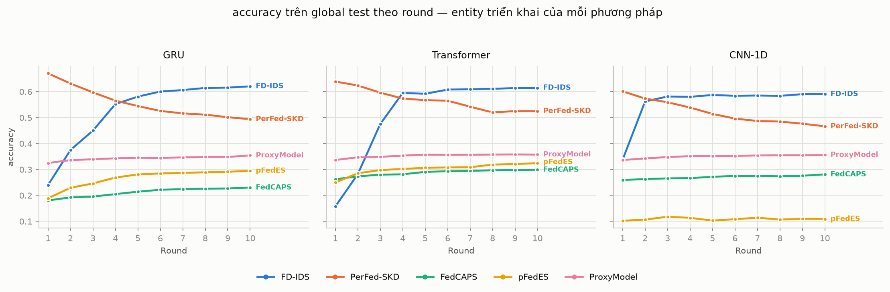

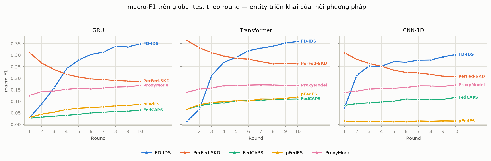

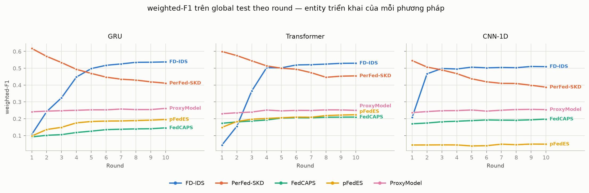

`macro_F1` đối xử mọi lớp như nhau nên nó là thước đo trung thực nhất cho bài
toán 34 lớp mất cân bằng nặng này; `weighted_F1` bị các lớp đa số chi phối.
Khoảng cách giữa hai biểu đồ trên chính là mức độ mô hình bỏ rơi lớp thiểu số.

### 8.3. Bảng so sánh theo từng round — đủ 10 metrics

Bảy nhóm bảng dưới đây phủ hết 10 metrics của hợp đồng đo lường. Nhóm đầu
tiên đồng thời là `accuracy`, `micro_precision`, `micro_recall` và `micro_f1`
— bốn đại lượng này bằng nhau về mặt toán học với phân loại đơn nhãn đa lớp,
nên chỉ cần một bảng thay vì bốn.

#### accuracy (= micro_P = micro_R = micro_F1) theo round

*accuracy (= micro_P = micro_R = micro_F1) · kịch bản 10 client **GRU** · entity triển khai*

| Round | FD-IDS | PerFed-SKD | FedCAPS | pFedES | ProxyModel |
|---:|---:|---:|---:|---:|---:|
| 1 | 0.2397 | 0.6705 | 0.1803 | 0.1887 | 0.3247 |
| 2 | 0.3749 | 0.6310 | 0.1924 | 0.2293 | 0.3360 |
| 3 | 0.4497 | 0.5970 | 0.1954 | 0.2459 | 0.3391 |
| 4 | 0.5518 | 0.5651 | 0.2049 | 0.2687 | 0.3429 |
| 5 | 0.5807 | 0.5443 | 0.2142 | 0.2806 | 0.3450 |
| 6 | 0.6003 | 0.5254 | 0.2216 | 0.2846 | 0.3443 |
| 7 | 0.6059 | 0.5161 | 0.2241 | 0.2867 | 0.3464 |
| 8 | 0.6142 | 0.5112 | 0.2258 | 0.2890 | 0.3481 |
| 9 | 0.6153 | 0.5012 | 0.2267 | 0.2909 | 0.3481 |
| 10 | 0.6204 | 0.4937 | 0.2303 | 0.2948 | 0.3541 |

> Cao nhất tại round 10: **FD-IDS** (0.6204)

*accuracy (= micro_P = micro_R = micro_F1) · kịch bản 10 client **Transformer** · entity triển khai*

| Round | FD-IDS | PerFed-SKD | FedCAPS | pFedES | ProxyModel |
|---:|---:|---:|---:|---:|---:|
| 1 | 0.1570 | 0.6388 | 0.2621 | 0.2496 | 0.3360 |
| 2 | 0.2816 | 0.6235 | 0.2732 | 0.2852 | 0.3470 |
| 3 | 0.4749 | 0.5959 | 0.2799 | 0.2975 | 0.3485 |
| 4 | 0.5948 | 0.5732 | 0.2812 | 0.3019 | 0.3532 |
| 5 | 0.5916 | 0.5671 | 0.2905 | 0.3063 | 0.3568 |
| 6 | 0.6078 | 0.5650 | 0.2930 | 0.3076 | 0.3561 |
| 7 | 0.6089 | 0.5419 | 0.2945 | 0.3085 | 0.3565 |
| 8 | 0.6107 | 0.5197 | 0.2967 | 0.3186 | 0.3574 |
| 9 | 0.6136 | 0.5248 | 0.2978 | 0.3210 | 0.3578 |
| 10 | 0.6144 | 0.5250 | 0.2988 | 0.3238 | 0.3572 |

> Cao nhất tại round 10: **FD-IDS** (0.6144)

*accuracy (= micro_P = micro_R = micro_F1) · kịch bản 10 client **CNN-1D** · entity triển khai*

| Round | FD-IDS | PerFed-SKD | FedCAPS | pFedES | ProxyModel |
|---:|---:|---:|---:|---:|---:|
| 1 | 0.3375 | 0.6011 | 0.2593 | 0.1020 | 0.3361 |
| 2 | 0.5621 | 0.5732 | 0.2628 | 0.1067 | 0.3423 |
| 3 | 0.5812 | 0.5588 | 0.2656 | 0.1176 | 0.3478 |
| 4 | 0.5798 | 0.5387 | 0.2665 | 0.1135 | 0.3512 |
| 5 | 0.5869 | 0.5141 | 0.2715 | 0.1028 | 0.3524 |
| 6 | 0.5837 | 0.4959 | 0.2751 | 0.1080 | 0.3522 |
| 7 | 0.5848 | 0.4868 | 0.2749 | 0.1140 | 0.3537 |
| 8 | 0.5835 | 0.4845 | 0.2736 | 0.1067 | 0.3545 |
| 9 | 0.5902 | 0.4763 | 0.2755 | 0.1096 | 0.3547 |
| 10 | 0.5901 | 0.4663 | 0.2810 | 0.1089 | 0.3557 |

> Cao nhất tại round 10: **FD-IDS** (0.5901)

#### macro_precision theo round

*macro_precision · kịch bản 10 client **GRU** · entity triển khai*

| Round | FD-IDS | PerFed-SKD | FedCAPS | pFedES | ProxyModel |
|---:|---:|---:|---:|---:|---:|
| 1 | 0.0218 | 0.3727 | 0.0243 | 0.0285 | 0.1168 |
| 2 | 0.0923 | 0.3332 | 0.0294 | 0.0371 | 0.1353 |
| 3 | 0.1833 | 0.3028 | 0.0309 | 0.0504 | 0.1442 |
| 4 | 0.2599 | 0.2698 | 0.0359 | 0.0625 | 0.1432 |
| 5 | 0.2979 | 0.2473 | 0.0456 | 0.0660 | 0.1449 |
| 6 | 0.3432 | 0.2382 | 0.0452 | 0.0682 | 0.1456 |
| 7 | 0.3604 | 0.2427 | 0.0486 | 0.0704 | 0.1499 |
| 8 | 0.3873 | 0.2436 | 0.0507 | 0.0760 | 0.1523 |
| 9 | 0.3884 | 0.2455 | 0.0519 | 0.0776 | 0.1543 |
| 10 | 0.3987 | 0.2453 | 0.0539 | 0.0806 | 0.1606 |

> Cao nhất tại round 10: **FD-IDS** (0.3987)

*macro_precision · kịch bản 10 client **Transformer** · entity triển khai*

| Round | FD-IDS | PerFed-SKD | FedCAPS | pFedES | ProxyModel |
|---:|---:|---:|---:|---:|---:|
| 1 | 0.0099 | 0.4262 | 0.0620 | 0.0615 | 0.1316 |
| 2 | 0.0809 | 0.3898 | 0.0761 | 0.0798 | 0.1459 |
| 3 | 0.2727 | 0.3518 | 0.0826 | 0.0904 | 0.1513 |
| 4 | 0.3147 | 0.3466 | 0.0876 | 0.0923 | 0.1650 |
| 5 | 0.3391 | 0.3339 | 0.0926 | 0.1004 | 0.1600 |
| 6 | 0.3825 | 0.3279 | 0.0934 | 0.0928 | 0.1640 |
| 7 | 0.3896 | 0.3173 | 0.0949 | 0.1057 | 0.1674 |
| 8 | 0.3976 | 0.3108 | 0.0991 | 0.1082 | 0.1599 |
| 9 | 0.4036 | 0.3138 | 0.0980 | 0.1017 | 0.1641 |
| 10 | 0.4085 | 0.3090 | 0.0999 | 0.1137 | 0.1670 |

> Cao nhất tại round 10: **FD-IDS** (0.4085)

*macro_precision · kịch bản 10 client **CNN-1D** · entity triển khai*

| Round | FD-IDS | PerFed-SKD | FedCAPS | pFedES | ProxyModel |
|---:|---:|---:|---:|---:|---:|
| 1 | 0.1401 | 0.4030 | 0.0778 | 0.0137 | 0.1349 |
| 2 | 0.2489 | 0.3645 | 0.0861 | 0.0151 | 0.1386 |
| 3 | 0.2855 | 0.3307 | 0.0957 | 0.0114 | 0.1491 |
| 4 | 0.3161 | 0.3111 | 0.0986 | 0.0139 | 0.1474 |
| 5 | 0.3464 | 0.3013 | 0.0982 | 0.0154 | 0.1503 |
| 6 | 0.3376 | 0.2950 | 0.1036 | 0.0123 | 0.1548 |
| 7 | 0.3356 | 0.2873 | 0.1003 | 0.0146 | 0.1614 |
| 8 | 0.3447 | 0.2765 | 0.1047 | 0.0150 | 0.1598 |
| 9 | 0.3805 | 0.2816 | 0.1093 | 0.0189 | 0.1579 |
| 10 | 0.3861 | 0.2860 | 0.1093 | 0.0185 | 0.1612 |

> Cao nhất tại round 10: **FD-IDS** (0.3861)

#### weighted_precision theo round

*weighted_precision · kịch bản 10 client **GRU** · entity triển khai*

| Round | FD-IDS | PerFed-SKD | FedCAPS | pFedES | ProxyModel |
|---:|---:|---:|---:|---:|---:|
| 1 | 0.0781 | 0.6841 | 0.0822 | 0.0907 | 0.2192 |
| 2 | 0.1945 | 0.6257 | 0.0940 | 0.1182 | 0.2208 |
| 3 | 0.3030 | 0.5846 | 0.0943 | 0.1482 | 0.2273 |
| 4 | 0.4360 | 0.5479 | 0.1141 | 0.1575 | 0.2237 |
| 5 | 0.4767 | 0.5236 | 0.1224 | 0.1647 | 0.2272 |
| 6 | 0.6079 | 0.4969 | 0.1174 | 0.1683 | 0.2267 |
| 7 | 0.6064 | 0.4882 | 0.1195 | 0.1675 | 0.2346 |
| 8 | 0.6097 | 0.4910 | 0.1212 | 0.1739 | 0.2284 |
| 9 | 0.6203 | 0.4942 | 0.1221 | 0.1753 | 0.2288 |
| 10 | 0.6192 | 0.4896 | 0.1256 | 0.1765 | 0.2360 |

> Cao nhất tại round 10: **FD-IDS** (0.6192)

*weighted_precision · kịch bản 10 client **Transformer** · entity triển khai*

| Round | FD-IDS | PerFed-SKD | FedCAPS | pFedES | ProxyModel |
|---:|---:|---:|---:|---:|---:|
| 1 | 0.0254 | 0.6816 | 0.1549 | 0.1325 | 0.2033 |
| 2 | 0.1653 | 0.6399 | 0.1579 | 0.1627 | 0.2058 |
| 3 | 0.3779 | 0.5956 | 0.1631 | 0.1775 | 0.2118 |
| 4 | 0.4900 | 0.5945 | 0.1701 | 0.1830 | 0.2273 |
| 5 | 0.4876 | 0.5770 | 0.1824 | 0.1959 | 0.2165 |
| 6 | 0.5389 | 0.5660 | 0.1831 | 0.1924 | 0.2245 |
| 7 | 0.5389 | 0.5344 | 0.1816 | 0.1943 | 0.2222 |
| 8 | 0.5397 | 0.5286 | 0.1854 | 0.1983 | 0.2263 |
| 9 | 0.5437 | 0.5265 | 0.1849 | 0.1952 | 0.2261 |
| 10 | 0.5442 | 0.5128 | 0.1876 | 0.2038 | 0.2237 |

> Cao nhất tại round 10: **FD-IDS** (0.5442)

*weighted_precision · kịch bản 10 client **CNN-1D** · entity triển khai*

| Round | FD-IDS | PerFed-SKD | FedCAPS | pFedES | ProxyModel |
|---:|---:|---:|---:|---:|---:|
| 1 | 0.3605 | 0.6750 | 0.1496 | 0.0463 | 0.2126 |
| 2 | 0.4620 | 0.6228 | 0.1532 | 0.0513 | 0.2189 |
| 3 | 0.4919 | 0.5663 | 0.1678 | 0.0361 | 0.2233 |
| 4 | 0.4973 | 0.5410 | 0.1772 | 0.0407 | 0.2210 |
| 5 | 0.5171 | 0.5301 | 0.1711 | 0.0398 | 0.2310 |
| 6 | 0.5140 | 0.5236 | 0.1739 | 0.0386 | 0.2177 |
| 7 | 0.5051 | 0.5233 | 0.1753 | 0.0448 | 0.2248 |
| 8 | 0.5133 | 0.5134 | 0.1729 | 0.0454 | 0.2324 |
| 9 | 0.5276 | 0.5161 | 0.1788 | 0.0645 | 0.2326 |
| 10 | 0.5356 | 0.5205 | 0.1775 | 0.0636 | 0.2312 |

> Cao nhất tại round 10: **FD-IDS** (0.5356)

#### macro_recall theo round

*macro_recall · kịch bản 10 client **GRU** · entity triển khai*

| Round | FD-IDS | PerFed-SKD | FedCAPS | pFedES | ProxyModel |
|---:|---:|---:|---:|---:|---:|
| 1 | 0.0592 | 0.3448 | 0.0627 | 0.0678 | 0.1995 |
| 2 | 0.1209 | 0.3134 | 0.0704 | 0.0905 | 0.2233 |
| 3 | 0.2104 | 0.2929 | 0.0772 | 0.1039 | 0.2301 |
| 4 | 0.2924 | 0.2774 | 0.0816 | 0.1196 | 0.2376 |
| 5 | 0.3305 | 0.2688 | 0.0857 | 0.1293 | 0.2422 |
| 6 | 0.3570 | 0.2626 | 0.0927 | 0.1348 | 0.2427 |
| 7 | 0.3630 | 0.2605 | 0.0982 | 0.1398 | 0.2465 |
| 8 | 0.3873 | 0.2586 | 0.1027 | 0.1444 | 0.2505 |
| 9 | 0.3840 | 0.2565 | 0.1056 | 0.1487 | 0.2501 |
| 10 | 0.3994 | 0.2559 | 0.1124 | 0.1534 | 0.2573 |

> Cao nhất tại round 10: **FD-IDS** (0.3994)

*macro_recall · kịch bản 10 client **Transformer** · entity triển khai*

| Round | FD-IDS | PerFed-SKD | FedCAPS | pFedES | ProxyModel |
|---:|---:|---:|---:|---:|---:|
| 1 | 0.0461 | 0.3945 | 0.1163 | 0.1230 | 0.2153 |
| 2 | 0.1093 | 0.3762 | 0.1366 | 0.1486 | 0.2369 |
| 3 | 0.2604 | 0.3588 | 0.1506 | 0.1632 | 0.2440 |
| 4 | 0.3299 | 0.3474 | 0.1553 | 0.1677 | 0.2529 |
| 5 | 0.3422 | 0.3405 | 0.1630 | 0.1738 | 0.2546 |
| 6 | 0.3705 | 0.3398 | 0.1677 | 0.1732 | 0.2560 |
| 7 | 0.3769 | 0.3296 | 0.1700 | 0.1792 | 0.2553 |
| 8 | 0.3826 | 0.3220 | 0.1751 | 0.1803 | 0.2583 |
| 9 | 0.3965 | 0.3225 | 0.1777 | 0.1885 | 0.2584 |
| 10 | 0.4012 | 0.3228 | 0.1785 | 0.1898 | 0.2609 |

> Cao nhất tại round 10: **FD-IDS** (0.4012)

*macro_recall · kịch bản 10 client **CNN-1D** · entity triển khai*

| Round | FD-IDS | PerFed-SKD | FedCAPS | pFedES | ProxyModel |
|---:|---:|---:|---:|---:|---:|
| 1 | 0.0992 | 0.3495 | 0.1425 | 0.0417 | 0.2162 |
| 2 | 0.2483 | 0.3310 | 0.1517 | 0.0431 | 0.2252 |
| 3 | 0.2853 | 0.3162 | 0.1572 | 0.0424 | 0.2356 |
| 4 | 0.2875 | 0.3065 | 0.1609 | 0.0409 | 0.2403 |
| 5 | 0.3028 | 0.2939 | 0.1671 | 0.0378 | 0.2449 |
| 6 | 0.3004 | 0.2843 | 0.1752 | 0.0390 | 0.2452 |
| 7 | 0.3076 | 0.2841 | 0.1727 | 0.0413 | 0.2490 |
| 8 | 0.3079 | 0.2788 | 0.1736 | 0.0397 | 0.2523 |
| 9 | 0.3221 | 0.2743 | 0.1729 | 0.0421 | 0.2526 |
| 10 | 0.3290 | 0.2732 | 0.1826 | 0.0417 | 0.2560 |

> Cao nhất tại round 10: **FD-IDS** (0.3290)

#### weighted_recall theo round

*weighted_recall · kịch bản 10 client **GRU** · entity triển khai*

| Round | FD-IDS | PerFed-SKD | FedCAPS | pFedES | ProxyModel |
|---:|---:|---:|---:|---:|---:|
| 1 | 0.2397 | 0.6705 | 0.1803 | 0.1887 | 0.3247 |
| 2 | 0.3749 | 0.6310 | 0.1924 | 0.2293 | 0.3360 |
| 3 | 0.4497 | 0.5970 | 0.1954 | 0.2459 | 0.3391 |
| 4 | 0.5518 | 0.5651 | 0.2049 | 0.2687 | 0.3429 |
| 5 | 0.5807 | 0.5443 | 0.2142 | 0.2806 | 0.3450 |
| 6 | 0.6003 | 0.5254 | 0.2216 | 0.2846 | 0.3443 |
| 7 | 0.6059 | 0.5161 | 0.2241 | 0.2867 | 0.3464 |
| 8 | 0.6142 | 0.5112 | 0.2258 | 0.2890 | 0.3481 |
| 9 | 0.6153 | 0.5012 | 0.2267 | 0.2909 | 0.3481 |
| 10 | 0.6204 | 0.4937 | 0.2303 | 0.2948 | 0.3541 |

> Cao nhất tại round 10: **FD-IDS** (0.6204)

*weighted_recall · kịch bản 10 client **Transformer** · entity triển khai*

| Round | FD-IDS | PerFed-SKD | FedCAPS | pFedES | ProxyModel |
|---:|---:|---:|---:|---:|---:|
| 1 | 0.1570 | 0.6388 | 0.2621 | 0.2496 | 0.3360 |
| 2 | 0.2816 | 0.6235 | 0.2732 | 0.2852 | 0.3470 |
| 3 | 0.4749 | 0.5959 | 0.2799 | 0.2975 | 0.3485 |
| 4 | 0.5948 | 0.5732 | 0.2812 | 0.3019 | 0.3532 |
| 5 | 0.5916 | 0.5671 | 0.2905 | 0.3063 | 0.3568 |
| 6 | 0.6078 | 0.5650 | 0.2930 | 0.3076 | 0.3561 |
| 7 | 0.6089 | 0.5419 | 0.2945 | 0.3085 | 0.3565 |
| 8 | 0.6107 | 0.5197 | 0.2967 | 0.3186 | 0.3574 |
| 9 | 0.6136 | 0.5248 | 0.2978 | 0.3210 | 0.3578 |
| 10 | 0.6144 | 0.5250 | 0.2988 | 0.3238 | 0.3572 |

> Cao nhất tại round 10: **FD-IDS** (0.6144)

*weighted_recall · kịch bản 10 client **CNN-1D** · entity triển khai*

| Round | FD-IDS | PerFed-SKD | FedCAPS | pFedES | ProxyModel |
|---:|---:|---:|---:|---:|---:|
| 1 | 0.3375 | 0.6011 | 0.2593 | 0.1020 | 0.3361 |
| 2 | 0.5621 | 0.5732 | 0.2628 | 0.1067 | 0.3423 |
| 3 | 0.5812 | 0.5588 | 0.2656 | 0.1176 | 0.3478 |
| 4 | 0.5798 | 0.5387 | 0.2665 | 0.1135 | 0.3512 |
| 5 | 0.5869 | 0.5141 | 0.2715 | 0.1028 | 0.3524 |
| 6 | 0.5837 | 0.4959 | 0.2751 | 0.1080 | 0.3522 |
| 7 | 0.5848 | 0.4868 | 0.2749 | 0.1140 | 0.3537 |
| 8 | 0.5835 | 0.4845 | 0.2736 | 0.1067 | 0.3545 |
| 9 | 0.5902 | 0.4763 | 0.2755 | 0.1096 | 0.3547 |
| 10 | 0.5901 | 0.4663 | 0.2810 | 0.1089 | 0.3557 |

> Cao nhất tại round 10: **FD-IDS** (0.5901)

#### macro-F1 theo round

*macro-F1 · kịch bản 10 client **GRU** · entity triển khai*

| Round | FD-IDS | PerFed-SKD | FedCAPS | pFedES | ProxyModel |
|---:|---:|---:|---:|---:|---:|
| 1 | 0.0276 | 0.3113 | 0.0266 | 0.0296 | 0.1243 |
| 2 | 0.0888 | 0.2656 | 0.0316 | 0.0442 | 0.1427 |
| 3 | 0.1563 | 0.2381 | 0.0354 | 0.0528 | 0.1446 |
| 4 | 0.2397 | 0.2169 | 0.0391 | 0.0644 | 0.1516 |
| 5 | 0.2786 | 0.2052 | 0.0435 | 0.0701 | 0.1563 |
| 6 | 0.3024 | 0.1972 | 0.0493 | 0.0731 | 0.1537 |
| 7 | 0.3125 | 0.1935 | 0.0525 | 0.0761 | 0.1573 |
| 8 | 0.3382 | 0.1899 | 0.0555 | 0.0805 | 0.1615 |
| 9 | 0.3355 | 0.1872 | 0.0569 | 0.0822 | 0.1629 |
| 10 | 0.3485 | 0.1856 | 0.0616 | 0.0868 | 0.1684 |

> Cao nhất tại round 10: **FD-IDS** (0.3485)

*macro-F1 · kịch bản 10 client **Transformer** · entity triển khai*

| Round | FD-IDS | PerFed-SKD | FedCAPS | pFedES | ProxyModel |
|---:|---:|---:|---:|---:|---:|
| 1 | 0.0137 | 0.3634 | 0.0665 | 0.0663 | 0.1388 |
| 2 | 0.0643 | 0.3319 | 0.0806 | 0.0848 | 0.1527 |
| 3 | 0.2105 | 0.3106 | 0.0898 | 0.0949 | 0.1576 |
| 4 | 0.2689 | 0.2958 | 0.0936 | 0.0983 | 0.1674 |
| 5 | 0.2900 | 0.2855 | 0.1016 | 0.1024 | 0.1681 |
| 6 | 0.3191 | 0.2823 | 0.1028 | 0.1008 | 0.1699 |
| 7 | 0.3300 | 0.2718 | 0.1038 | 0.1098 | 0.1712 |
| 8 | 0.3385 | 0.2624 | 0.1088 | 0.1094 | 0.1703 |
| 9 | 0.3523 | 0.2633 | 0.1091 | 0.1123 | 0.1687 |
| 10 | 0.3587 | 0.2627 | 0.1099 | 0.1186 | 0.1685 |

> Cao nhất tại round 10: **FD-IDS** (0.3587)

*macro-F1 · kịch bản 10 client **CNN-1D** · entity triển khai*

| Round | FD-IDS | PerFed-SKD | FedCAPS | pFedES | ProxyModel |
|---:|---:|---:|---:|---:|---:|
| 1 | 0.0707 | 0.3096 | 0.0822 | 0.0139 | 0.1383 |
| 2 | 0.2126 | 0.2814 | 0.0901 | 0.0138 | 0.1441 |
| 3 | 0.2527 | 0.2640 | 0.0934 | 0.0130 | 0.1528 |
| 4 | 0.2518 | 0.2514 | 0.0970 | 0.0129 | 0.1552 |
| 5 | 0.2717 | 0.2348 | 0.1002 | 0.0115 | 0.1565 |
| 6 | 0.2691 | 0.2245 | 0.1097 | 0.0117 | 0.1595 |
| 7 | 0.2781 | 0.2230 | 0.1084 | 0.0149 | 0.1666 |
| 8 | 0.2786 | 0.2163 | 0.1088 | 0.0136 | 0.1663 |
| 9 | 0.2925 | 0.2086 | 0.1081 | 0.0152 | 0.1644 |
| 10 | 0.3017 | 0.2071 | 0.1162 | 0.0144 | 0.1701 |

> Cao nhất tại round 10: **FD-IDS** (0.3017)

#### weighted-F1 theo round

*weighted-F1 · kịch bản 10 client **GRU** · entity triển khai*

| Round | FD-IDS | PerFed-SKD | FedCAPS | pFedES | ProxyModel |
|---:|---:|---:|---:|---:|---:|
| 1 | 0.1068 | 0.6175 | 0.0916 | 0.0973 | 0.2410 |
| 2 | 0.2420 | 0.5704 | 0.1014 | 0.1357 | 0.2451 |
| 3 | 0.3244 | 0.5336 | 0.1053 | 0.1488 | 0.2476 |
| 4 | 0.4475 | 0.4933 | 0.1179 | 0.1754 | 0.2500 |
| 5 | 0.4978 | 0.4691 | 0.1261 | 0.1834 | 0.2528 |
| 6 | 0.5175 | 0.4469 | 0.1349 | 0.1859 | 0.2526 |
| 7 | 0.5255 | 0.4349 | 0.1375 | 0.1866 | 0.2574 |
| 8 | 0.5351 | 0.4296 | 0.1394 | 0.1889 | 0.2542 |
| 9 | 0.5357 | 0.4191 | 0.1404 | 0.1916 | 0.2544 |
| 10 | 0.5374 | 0.4110 | 0.1455 | 0.1954 | 0.2612 |

> Cao nhất tại round 10: **FD-IDS** (0.5374)

*weighted-F1 · kịch bản 10 client **Transformer** · entity triển khai*

| Round | FD-IDS | PerFed-SKD | FedCAPS | pFedES | ProxyModel |
|---:|---:|---:|---:|---:|---:|
| 1 | 0.0436 | 0.5994 | 0.1727 | 0.1485 | 0.2297 |
| 2 | 0.1551 | 0.5750 | 0.1810 | 0.1833 | 0.2352 |
| 3 | 0.3646 | 0.5440 | 0.1862 | 0.1971 | 0.2396 |
| 4 | 0.5030 | 0.5140 | 0.1922 | 0.2011 | 0.2513 |
| 5 | 0.5023 | 0.5000 | 0.2039 | 0.2057 | 0.2465 |
| 6 | 0.5195 | 0.4943 | 0.2057 | 0.2096 | 0.2494 |
| 7 | 0.5212 | 0.4736 | 0.2054 | 0.2088 | 0.2491 |
| 8 | 0.5246 | 0.4460 | 0.2086 | 0.2186 | 0.2524 |
| 9 | 0.5291 | 0.4528 | 0.2093 | 0.2218 | 0.2522 |
| 10 | 0.5298 | 0.4545 | 0.2096 | 0.2235 | 0.2494 |

> Cao nhất tại round 10: **FD-IDS** (0.5298)

*weighted-F1 · kịch bản 10 client **CNN-1D** · entity triển khai*

| Round | FD-IDS | PerFed-SKD | FedCAPS | pFedES | ProxyModel |
|---:|---:|---:|---:|---:|---:|
| 1 | 0.2084 | 0.5454 | 0.1698 | 0.0437 | 0.2365 |
| 2 | 0.4666 | 0.5069 | 0.1743 | 0.0439 | 0.2423 |
| 3 | 0.4985 | 0.4897 | 0.1818 | 0.0444 | 0.2476 |
| 4 | 0.4954 | 0.4680 | 0.1849 | 0.0440 | 0.2481 |
| 5 | 0.5063 | 0.4373 | 0.1886 | 0.0381 | 0.2519 |
| 6 | 0.5023 | 0.4194 | 0.1927 | 0.0395 | 0.2449 |
| 7 | 0.5043 | 0.4101 | 0.1915 | 0.0485 | 0.2505 |
| 8 | 0.5032 | 0.4093 | 0.1911 | 0.0454 | 0.2543 |
| 9 | 0.5103 | 0.3987 | 0.1934 | 0.0493 | 0.2555 |
| 10 | 0.5094 | 0.3874 | 0.1976 | 0.0486 | 0.2541 |

> Cao nhất tại round 10: **FD-IDS** (0.5094)

### 8.4. Round 10 — đủ 10 metrics, cả 15 lần chạy

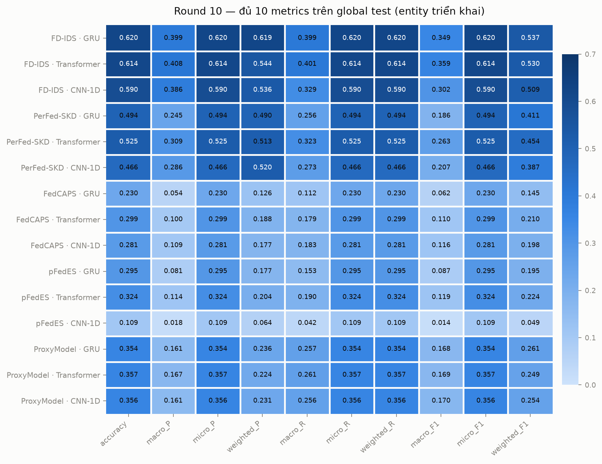

| Phương pháp | Kịch bản | Entity | accuracy | macro_P | micro_P | weighted_P | macro_R | micro_R | weighted_R | macro_F1 | micro_F1 | weighted_F1 |
|---|---|---|---:|---:|---:|---:|---:|---:|---:|---:|---:|---:|
| FD-IDS | GRU | server | 0.6204 | 0.3987 | 0.6204 | 0.6192 | 0.3994 | 0.6204 | 0.6204 | 0.3485 | 0.6204 | 0.5374 |
| FD-IDS | Transformer | server | 0.6144 | 0.4085 | 0.6144 | 0.5442 | 0.4012 | 0.6144 | 0.6144 | 0.3587 | 0.6144 | 0.5298 |
| FD-IDS | CNN-1D | server | 0.5901 | 0.3861 | 0.5901 | 0.5356 | 0.3290 | 0.5901 | 0.5901 | 0.3017 | 0.5901 | 0.5094 |
| PerFed-SKD | GRU | TB 10 client | 0.4937 | 0.2453 | 0.4937 | 0.4896 | 0.2559 | 0.4937 | 0.4937 | 0.1856 | 0.4937 | 0.4110 |
| PerFed-SKD | Transformer | TB 10 client | 0.5250 | 0.3090 | 0.5250 | 0.5128 | 0.3228 | 0.5250 | 0.5250 | 0.2627 | 0.5250 | 0.4545 |
| PerFed-SKD | CNN-1D | TB 10 client | 0.4663 | 0.2860 | 0.4663 | 0.5205 | 0.2732 | 0.4663 | 0.4663 | 0.2071 | 0.4663 | 0.3874 |
| FedCAPS | GRU | TB 10 client | 0.2303 | 0.0539 | 0.2303 | 0.1256 | 0.1124 | 0.2303 | 0.2303 | 0.0616 | 0.2303 | 0.1455 |
| FedCAPS | Transformer | TB 10 client | 0.2988 | 0.0999 | 0.2988 | 0.1876 | 0.1785 | 0.2988 | 0.2988 | 0.1099 | 0.2988 | 0.2096 |
| FedCAPS | CNN-1D | TB 10 client | 0.2810 | 0.1093 | 0.2810 | 0.1775 | 0.1826 | 0.2810 | 0.2810 | 0.1162 | 0.2810 | 0.1976 |
| pFedES | GRU | TB 10 client | 0.2948 | 0.0806 | 0.2948 | 0.1765 | 0.1534 | 0.2948 | 0.2948 | 0.0868 | 0.2948 | 0.1954 |
| pFedES | Transformer | TB 10 client | 0.3238 | 0.1137 | 0.3238 | 0.2038 | 0.1898 | 0.3238 | 0.3238 | 0.1186 | 0.3238 | 0.2235 |
| pFedES | CNN-1D | TB 10 client | 0.1089 | 0.0185 | 0.1089 | 0.0636 | 0.0417 | 0.1089 | 0.1089 | 0.0144 | 0.1089 | 0.0486 |
| ProxyModel | GRU | TB 10 client | 0.3541 | 0.1606 | 0.3541 | 0.2360 | 0.2573 | 0.3541 | 0.3541 | 0.1684 | 0.3541 | 0.2612 |
| ProxyModel | Transformer | TB 10 client | 0.3572 | 0.1670 | 0.3572 | 0.2237 | 0.2609 | 0.3572 | 0.3572 | 0.1685 | 0.3572 | 0.2494 |
| ProxyModel | CNN-1D | TB 10 client | 0.3557 | 0.1612 | 0.3557 | 0.2312 | 0.2560 | 0.3557 | 0.3557 | 0.1701 | 0.3557 | 0.2541 |

Và cột **server** của ba phương pháp có server classifier:

| Phương pháp | Kịch bản | accuracy | macro_P | micro_P | weighted_P | macro_R | micro_R | weighted_R | macro_F1 | micro_F1 | weighted_F1 |
|---|---|---:|---:|---:|---:|---:|---:|---:|---:|---:|---:|
| FD-IDS | GRU | 0.6204 | 0.3987 | 0.6204 | 0.6192 | 0.3994 | 0.6204 | 0.6204 | 0.3485 | 0.6204 | 0.5374 |
| FD-IDS | Transformer | 0.6144 | 0.4085 | 0.6144 | 0.5442 | 0.4012 | 0.6144 | 0.6144 | 0.3587 | 0.6144 | 0.5298 |
| FD-IDS | CNN-1D | 0.5901 | 0.3861 | 0.5901 | 0.5356 | 0.3290 | 0.5901 | 0.5901 | 0.3017 | 0.5901 | 0.5094 |
| PerFed-SKD | GRU | 0.6408 | 0.3161 | 0.6408 | 0.5595 | 0.3546 | 0.6408 | 0.6408 | 0.2791 | 0.6408 | 0.5689 |
| PerFed-SKD | Transformer | 0.6328 | 0.3622 | 0.6328 | 0.5971 | 0.3687 | 0.6328 | 0.6328 | 0.3157 | 0.6328 | 0.5831 |
| PerFed-SKD | CNN-1D | 0.5286 | 0.3625 | 0.5286 | 0.6167 | 0.2693 | 0.5286 | 0.5286 | 0.2203 | 0.5286 | 0.4514 |
| ProxyModel | GRU | 0.6205 | 0.4231 | 0.6205 | 0.6633 | 0.4165 | 0.6205 | 0.6205 | 0.3593 | 0.6205 | 0.5307 |
| ProxyModel | Transformer | 0.6185 | 0.4425 | 0.6185 | 0.6651 | 0.4138 | 0.6185 | 0.6185 | 0.3572 | 0.6185 | 0.5251 |
| ProxyModel | CNN-1D | 0.6151 | 0.4361 | 0.6151 | 0.6616 | 0.4135 | 0.6151 | 0.6151 | 0.3545 | 0.6151 | 0.5220 |

### 8.5. Khoảng cách server ↔ client

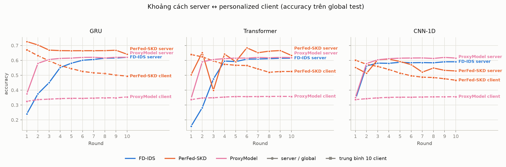

Ba phương pháp có cả hai entity cho ra ba dáng đồ thị hoàn toàn khác nhau:

- **FD-IDS** (GRU): chỉ có server, đi lên đều từ 0.2397 → **0.6204**.
- **PerFed-SKD** (GRU): server 0.7261 → **0.6408**, client 0.6705 → **0.4937** (chênh **0.1471**).
- **ProxyModel** (GRU): server 0.3748 → **0.6205**, client 0.3247 → **0.3541** (chênh **0.2664**).

<a id="phân-tán-giữa-các-client"></a>
### 8.6. Phân tán giữa các client

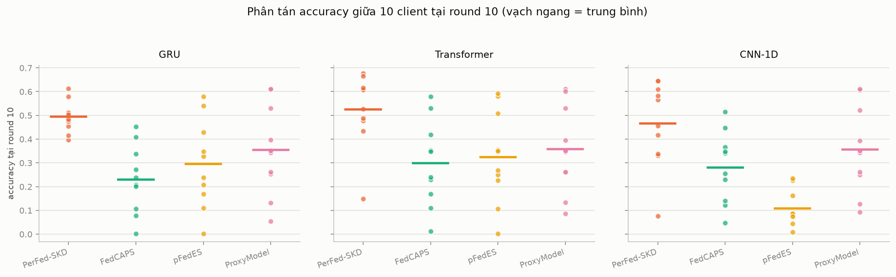

Trung bình 10 client là một con số **rất dễ gây hiểu nhầm**. Bảng dưới cho
thấy khoảng cách giữa client tốt nhất và tệ nhất tại round 10:

| Phương pháp | Kịch bản | min | trung bình | max | độ lệch chuẩn | biên độ |
|---|---|---:|---:|---:|---:|---:|
| PerFed-SKD | GRU | 0.3970 | 0.4937 | 0.6134 | 0.0631 | 0.2164 |
| PerFed-SKD | Transformer | 0.1483 | 0.5250 | 0.6765 | 0.1478 | 0.5283 |
| PerFed-SKD | CNN-1D | 0.0758 | 0.4663 | 0.6466 | 0.1725 | 0.5707 |
| FedCAPS | GRU | 0.0021 | 0.2303 | 0.4527 | 0.1365 | 0.4506 |
| FedCAPS | Transformer | 0.0122 | 0.2988 | 0.5796 | 0.1717 | 0.5674 |
| FedCAPS | CNN-1D | 0.0465 | 0.2810 | 0.5153 | 0.1421 | 0.4688 |
| pFedES | GRU | 0.0021 | 0.2948 | 0.5790 | 0.1758 | 0.5769 |
| pFedES | Transformer | 0.0021 | 0.3238 | 0.5917 | 0.1848 | 0.5896 |
| pFedES | CNN-1D | 0.0083 | 0.1089 | 0.2352 | 0.0709 | 0.2269 |
| ProxyModel | GRU | 0.0534 | 0.3541 | 0.6112 | 0.1797 | 0.5578 |
| ProxyModel | Transformer | 0.0853 | 0.3572 | 0.6102 | 0.1726 | 0.5249 |
| ProxyModel | CNN-1D | 0.0925 | 0.3557 | 0.6116 | 0.1728 | 0.5191 |

Client tốt nhất của pFedES-Transformer đạt **0,5917** — ngang ngửa server của
FD-IDS — nhưng client tệ nhất chỉ **0,0021**, kéo trung bình xuống 0,3238.
Client 0,0021 chính là client 1: nó chỉ thấy 8/34 lớp với 87,7% dồn vào một
lớp, nên model của nó gần như chỉ đoán được đúng một lớp trên tập test 34 lớp.

### 8.7. Chi phí

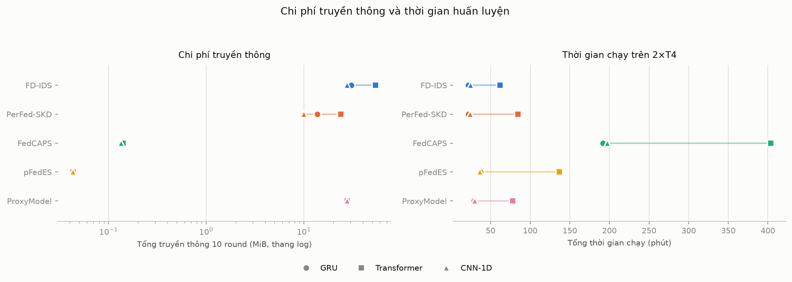

| Phương pháp | Truyền thông 10 round (MiB) | Thời gian GRU | Thời gian Transformer | Thời gian CNN-1D |
|---|---:|---:|---:|---:|
| FD-IDS | 30.544 | 22.1 phút | 61.9 phút | 24.7 phút |
| PerFed-SKD | 13.745 | 21.8 phút | 84.7 phút | 24.3 phút |
| FedCAPS | 0.135 | 191.8 phút | 403.6 phút | 197.7 phút |
| pFedES | 0.043 | 37.5 phút | 136.8 phút | 36.6 phút |
| ProxyModel | 27.716 | 28.9 phút | 77.8 phút | 30.1 phút |

Chênh lệch truyền thông giữa pFedES (0,043 MiB) và FD-IDS (30,5 MiB) là
**hơn 700 lần**. FedCAPS truyền ít thứ hai (0,135 MiB) nhưng lại tốn thời gian
nhất (191–404 phút) vì pha tìm kiếm MARLFS + encoder + PPO chạy trước khi
huấn luyện classifier.

---

## 9. Phân tích điểm mạnh — điểm yếu

Phân tích dưới đây rút ra **từ chính số liệu đo được**, không phải từ tuyên bố
của bài báo gốc.

### FD-IDS

**Điểm mạnh**

- **Đường học ổn định nhất trong cả năm phương pháp.** Accuracy GRU đi lên đơn
  điệu suốt 10 round (0,2397 → 0,6204) không có một lần tụt nào. Đây là bằng chứng
  trực tiếp cho tuyên bố chống *model drift* của bài báo: KD kéo model cục bộ về
  phía global, FedProx chặn biên độ lệch, FedAvg có trọng số không cho client nhỏ
  lấn át.
- **Kết quả cuối cao nhất trong nhóm "một model duy nhất"** ở kịch bản GRU
  (0,6204) và gần bằng ProxyModel-server ở hai kịch bản còn lại.
- **Bền với việc đổi kiến trúc.** Ba backbone rất khác nhau đều về đích trong dải
  hẹp 0,5901–0,6204. Cơ chế không phụ thuộc vào lựa chọn model.
- **Rẻ về thời gian.** 22–25 phút cho GRU/CNN-1D, thuộc nhóm nhanh nhất.

**Điểm yếu**

- **Không dùng được cho môi trường dị thể** — hạn chế nghiêm trọng nhất. FedAvg
  trên toàn bộ tham số buộc mọi client phải giống hệt nhau về kiến trúc.
- **Không có personalization.** Chỉ có một model cho cả 10 client. Client 6 (chỉ
  5/34 lớp) và client 8 (28/34 lớp) buộc phải dùng chung một bộ trọng số.
- **`macro_F1` chỉ đạt 0,3485** dù accuracy 0,6204. Khoảng cách 0,27 này cho thấy
  model bỏ rơi phần lớn các lớp thiểu số — nó chủ yếu đoán đúng vài lớp đa số.
- **Tốn truyền thông nhất** cùng với ProxyModel: 30,5 MiB, vì phải gửi toàn bộ
  40.034 tham số hai chiều × 10 client × 10 round.
- **Khởi đầu chậm.** Transformer mất tới 4 round mới vượt 0,55, do phải học lại
  từ đầu ở mỗi round.

### PerFed-SKD

**Điểm mạnh**

- **Round 1 mạnh nhất trong cả năm phương pháp.** Server pretrain một epoch trên
  `global_train_data.csv` cho ngay 0,7261 accuracy (GRU) — cao hơn *bất kỳ* con số
  nào mà bốn phương pháp còn lại đạt được sau 10 round.
- **Có personalization thật.** Mỗi client giữ state riêng và teacher lịch sử riêng.
- **Trung bình client cao nhất trong nhóm personalized**: 0,5250 (Transformer),
  0,4937 (GRU) — vượt xa FedCAPS (0,2988) và pFedES (0,3238).
- **Cơ chế chọn client theo ngưỡng có ích thật cho thiết bị yếu:** client đang tốt
  không bị ép nhận global model, giảm cả tính toán lẫn truyền thông. Truyền thông
  13,7 MiB, chỉ bằng 45% của FD-IDS.
- **Client tốt nhất đạt 0,6765** (Transformer) — cao hơn cả server FD-IDS.

**Điểm yếu**

- **Đây là phương pháp duy nhất mà kết quả ĐI XUỐNG theo round.** Trung bình client
  GRU: 0,6705 (r1) → **0,4937** (r10), mất 0,1768 tuyệt đối. Server GRU cũng giảm
  0,7261 → 0,6408. Cả ba kịch bản đều cùng xu hướng.

  Nguyên nhân đọc được từ chính cơ chế: teacher của SKD là **chính model đó ở round
  trước**, không có neo ngoài. Khi client bắt đầu chuyên biệt hoá vào phân bố cục
  bộ cực lệch của mình, SKD **củng cố chính sai lệch đó** qua từng round. Ngưỡng
  chọn client cũng không cứu được, vì nó chỉ so accuracy tương đối giữa các client
  chứ không so với một chuẩn tuyệt đối.
- **Vì thế round 10 là điểm dừng tệ nhất cho phương pháp này.** Nếu dừng ở round 1
  hoặc 2 thì PerFed-SKD thắng tuyệt đối. Hợp đồng thí nghiệm chốt round 10 làm
  endpoint nên con số báo cáo không phản ánh khả năng tốt nhất của nó.
- **Không dùng được cho dị thể mô hình** — vẫn trung bình tham số.
- **Server không ổn định ở Transformer:** dao động 0,3979 (r3) → 0,6840 (r6) →
  0,6328 (r10). Trung bình không trọng số trên tập client được chọn khiến một
  client xấu có thể kéo cả global model đi.
- **Chậm nhất ở Transformer:** 84,7 phút.

### FedCAPS

**Điểm mạnh**

- **Phương pháp duy nhất hỗ trợ dị thể mà không truyền một tham số nào.** Chỉ
  chỉ số feature và điểm số rời khỏi client — mức bảo vệ riêng tư cao nhất trong
  năm phương pháp.
- **Truyền thông gần như bằng không:** 0,135 MiB cho toàn bộ pipeline, thấp thứ
  hai chỉ sau pFedES.
- **Đường học đơn điệu tăng** ở cả ba kịch bản, không có dấu hiệu drift.
- **Có khả năng diễn giải.** Đây là phương pháp duy nhất trả về một câu trả lời
  đọc được bằng mắt: subset feature được chọn. Ba kịch bản chọn ra ba subset khác
  nhau nhưng **`DNS` xuất hiện ở cả ba**, `TCP` ở hai — tín hiệu nhất quán rằng
  các feature giao thức mang nhiều thông tin phân biệt nhất.
- **Đạt kết quả này chỉ với 6–8 trên 25 feature**, tức bỏ 68–76% chiều dữ liệu.

**Điểm yếu**

- **Kết quả tuyệt đối thấp nhất nhì:** 0,2303–0,2988 accuracy. Nguyên nhân trực
  tiếp là **subset quá nhỏ**: 6 feature (GRU, CNN-1D) hoặc 8 (Transformer) không
  đủ để phân biệt 34 lớp tấn công.

  Đây là hệ quả của hàm reward `R = λ·(hiệu năng) + (1−λ)·(độ ngắn)` với **`λ` =
  0,1** — tức 90% trọng số dồn vào việc làm subset ngắn, chỉ 10% cho hiệu năng.
  Cấu hình này ưu tiên nén mạnh hơn là độ chính xác. **Tăng `λ` là hướng cải thiện
  rõ ràng nhất** và không đòi hỏi thay đổi gì về phương pháp.
- **Đắt nhất về thời gian:** 191,8–403,6 phút, gấp 5–9 lần FD-IDS. Pha MARLFS
  (2.444 giây) + encoder–decoder (661 giây) + PPO (817 giây) chạy trước khi
  classifier bắt đầu học.
- **Phân tán client rất lớn:** biên độ 0,4506 ở GRU, client tệ nhất 0,0021.
- **Không phải phương pháp học liên kết đúng nghĩa.** Sau khi chốt subset, các
  classifier học độc lập hoàn toàn, không FedAvg. Phần "federated" chỉ nằm ở khâu
  chọn feature.

### pFedES

**Điểm mạnh**

- **Rẻ nhất tuyệt đối về truyền thông: 0,043 MiB cho 10 round** — chỉ 228 byte mỗi
  lần gửi. Thấp hơn FD-IDS **hơn 700 lần** và thấp hơn ProxyModel **640 lần**.
  Với mạng IoT băng thông hẹp, đây là khác biệt mang tính quyết định.
- **Hỗ trợ dị thể ở mức rẻ nhất.** Chỉ cần proxy giữ ràng buộc vào = ra; mọi thứ
  khác trên client là tự do.
- **Model cục bộ không bao giờ rời thiết bị** — không có rủi ro rò rỉ mô hình.
- **Đường học tăng đều** ở GRU (0,1887 → 0,2948) và Transformer (0,2496 → 0,3238),
  chứng tỏ 57 tham số proxy vẫn truyền tải được tri thức toàn cục.
- **Client tốt nhất đạt 0,5917** (Transformer) — cho thấy giới hạn không nằm ở
  phương pháp mà ở việc chấm model personalized trên tập test toàn cục.

**Điểm yếu**

- **Kịch bản CNN-1D gần như thất bại: 0,1089 accuracy, macro-F1 0,0144.** Đây là
  kết quả tệ nhất trong toàn bộ 15 lần chạy, và nó **không cải thiện qua round**
  (0,1020 ở r1 → 0,1089 ở r10). Hai kịch bản kia đều tăng đều, nên đây là vấn đề
  riêng của tổ hợp CNN-1D + proxy 57 tham số, cần điều tra thêm — nghi vấn hàng
  đầu là BatchNorm trong CNN-1D phản ứng xấu với dữ liệu đã qua proxy conv chưa
  hội tụ.
- **Kênh truyền tri thức quá hẹp.** 57 tham số là tất cả những gì 10 client dùng
  để trao đổi. So với ProxyModel (35.874 tham số proxy) đạt server 0,6205, cái giá
  của việc rẻ là rất rõ.
- **Không có model toàn cục dùng được.** Server chỉ giữ extractor 25→25, không
  phát logits 34 lớp, nên cột server là `not_applicable`. Không có gì để triển
  khai cho một client mới chưa có dữ liệu.
- **Phân tán client rất lớn:** biên độ 0,5896 ở Transformer.
- **Chậm hơn dự kiến:** 136,8 phút ở Transformer, do mỗi round phải chạy hai pha
  huấn luyện tuần tự.

### ProxyModel

**Điểm mạnh**

- **Global proxy là entity mạnh nhất trong toàn bộ thí nghiệm.** 0,6205 (GRU),
  0,6185 (Transformer), 0,6151 (CNN-1D) — nhỉnh hơn cả FD-IDS, và **ổn định nhất
  giữa ba kịch bản** (biên độ chỉ 0,0054).
- **Hội tụ nhanh nhất.** Chỉ 2 round đã đạt 0,58; round 3 đã vượt 0,60. FD-IDS
  cần 5–6 round mới tới ngưỡng đó.
- **Có cả hai thứ cùng lúc:** một global model dùng được ngay *và* 10 model
  personalized. Không phương pháp nào khác cho cả hai.
- **Hỗ trợ dị thể**, và là phương pháp duy nhất mà **bài gốc thực sự vận hành
  trong chế độ dị thể** (NAS sinh kiến trúc riêng cho từng hộ).
- **Adaptive mutual distillation hiệu quả:** trao đổi qua logits nên hoàn toàn
  không phụ thuộc kiến trúc, mà vẫn đạt kết quả cao nhất.

**Điểm yếu**

- **Trung bình client chỉ 0,3541–0,3572**, thấp hơn PerFed-SKD (0,4937–0,5250)
  khá nhiều, dù server thì cao hơn. Mutual distillation hai chiều kéo model
  personalized về phía proxy chung, làm giảm mức độ cá nhân hoá — đúng phần mà
  bài toán personalized cần.
- **Đắt truyền thông: 27,7 MiB**, gần bằng FD-IDS và gấp **640 lần** pFedES. Proxy
  là một classifier đầy đủ chứ không phải extractor nhỏ.
- **Mất phần cốt lõi khi build lại.** NAS bị bỏ, nên tính dị thể — thứ tạo nên giá
  trị chính của bài báo — không được tái hiện. Kết quả ở đây đo một phiên bản
  ProxyModel đã bị lược bớt.
- **Đổi bài toán.** Bài gốc là hồi quy NILM đo bằng MAE/SAE; bản build lại là phân
  loại 34 lớp. Các kết luận của bài gốc **không chuyển giao trực tiếp**.
- **Phân tán client lớn:** biên độ 0,5578 (GRU).
- **Round 10 tốn thêm thời gian** (235 giây so với ~165 giây các round khác) do có
  pha fine-tune personalized cuối.

### Bảng tổng kết đối chiếu

| Tiêu chí | FD-IDS | PerFed-SKD | FedCAPS | pFedES | ProxyModel |
|---|---|---|---|---|---|
| Accuracy tốt nhất (entity triển khai) | **0,6204** | 0,5250 | 0,2988 | 0,3238 | 0,3572 |
| Accuracy server tốt nhất | **0,6204** | 0,6408 | — | — | **0,6205** |
| macro-F1 tốt nhất | **0,3587** | 0,2627 | 0,1162 | 0,1186 | 0,1701 |
| Xu hướng theo round | tăng đều | **giảm đều** | tăng đều | tăng (CNN-1D đứng yên) | tăng đều |
| Truyền thông | 30,5 MiB | 13,7 MiB | 0,135 MiB | **0,043 MiB** | 27,7 MiB |
| Thời gian (GRU) | **22,1 phút** | **21,8 phút** | 191,8 phút | 37,5 phút | 28,9 phút |
| Dị thể kích thước mô hình | ✗ | ✗ | ✓ | ✓ | ✓ |
| Dị thể loại mô hình | ✗ | ✗ | ✓ | ✓ | ✓ |
| Có global model dùng được | ✓ | ✓ | ✗ | ✗ | ✓ |
| Có personalization | ✗ | ✓ | ✓ | ✓ | ✓ |
| Bền giữa 3 kịch bản | ✓ | trung bình | ✓ | ✗ (CNN-1D hỏng) | **✓ tốt nhất** |

---

## 10. Kết luận

**Không có phương pháp nào thắng toàn diện** — mỗi phương pháp tối ưu cho một
ràng buộc khác nhau, và điều đó thể hiện rõ trong số liệu:

| Nếu ràng buộc của bạn là… | Chọn | Vì |
|---|---|---|
| Cần một model tổng quát mạnh nhất | **ProxyModel (server)** | 0,6205 GRU, ổn định nhất giữa 3 kịch bản, hội tụ sau 2 round |
| Mọi client giống hệt nhau, cần global model | **FD-IDS** | 0,6204 GRU, đường học ổn định nhất, cơ chế đơn giản nhất |
| Băng thông là nút thắt | **pFedES** | 0,043 MiB — rẻ hơn 700 lần, nhưng phải tránh CNN-1D |
| Client dùng kiến trúc khác nhau | **pFedES** hoặc **ProxyModel** | chỉ FedAvg proxy; ProxyModel mạnh hơn, pFedES rẻ hơn |
| Riêng tư là ưu tiên cao nhất | **FedCAPS** | không truyền tham số mô hình, chỉ chỉ số feature |
| Cần personalization thật sự | **PerFed-SKD** | TB client cao nhất (0,5250), nhưng **phải dừng sớm** |
| Cần giải thích được mô hình | **FedCAPS** | trả về subset feature đọc được |

### Ba phát hiện đáng chú ý nhất

1. **PerFed-SKD suy giảm theo round.** Đây là kết quả trái ngược với kỳ vọng
   và là phát hiện quan trọng nhất của thí nghiệm. Self-knowledge distillation
   không có neo ngoài, nên trên dữ liệu cực lệch nó khuếch đại chính sai lệch
   của client. Nếu triển khai thật, cần **early stopping** hoặc thêm một neo
   toàn cục vào hàm loss.
2. **pFedES + CNN-1D hỏng.** 0,1089 accuracy và không cải thiện qua 10 round,
   trong khi GRU và Transformer đều tăng đều. Đây là một lỗi tương tác cụ thể
   cần điều tra, không phải giới hạn của phương pháp.
3. **FedCAPS bị `λ` = 0,1 kìm hãm.** Hàm reward dồn 90% trọng số vào độ ngắn
   của subset, nên chỉ giữ 6–8/25 feature. Kết quả thấp phản ánh cấu hình
   siêu tham số chứ không phải năng lực phương pháp — đây là hướng cải thiện
   rẻ nhất trong cả năm phương pháp.

### Giới hạn của thí nghiệm này

Cần nêu rõ để tránh kết luận quá đà:

- **Cả 10 client dùng cùng một kiến trúc trong mọi kịch bản.** Vì vậy khả năng
  dị thể của FedCAPS, pFedES và ProxyModel **được suy ra từ cơ chế, chưa được
  kiểm chứng bằng số đo**. Đây là hướng thí nghiệm tiếp theo rõ ràng nhất.
- **Model personalized bị chấm trên tập test toàn cục 34 lớp.** Cách đo này
  có lợi cho phương pháp global và bất lợi cho phương pháp personalized. Một
  phép đo bổ sung trên tập test riêng của từng client sẽ cho bức tranh công
  bằng hơn.
- **Round 10 là điểm dừng cố định.** Với PerFed-SKD, đây là điểm dừng tệ nhất;
  với các phương pháp còn lại, đường học vẫn đang đi lên và chưa hội tụ.
- **Mỗi cấu hình chỉ chạy một lần với seed 42.** Không có khoảng tin cậy, nên
  các chênh lệch nhỏ (dưới ~0,01) không nên được diễn giải là có ý nghĩa.
- **Ba trong năm bài báo không xác định được năm/nơi xuất bản** từ bản `.md`
  trong repo.

---

## Phụ lục — nguồn dữ liệu

- Dữ liệu thô: `metrics/evaluation_metrics.csv` của 15 lần chạy
- Tổng hợp dạng máy đọc: [`all_methods_metrics.csv`](../all_methods_metrics.csv)
- Biểu đồ so sánh chéo: [`report_assets/`](../report_assets/)
- Script sinh báo cáo: [`scripts/build_report.py`](../scripts/build_report.py)

Chạy lại toàn bộ:

```bash
/home/odixe/miniforge3/envs/nckh/bin/python scripts/build_report.py
```
